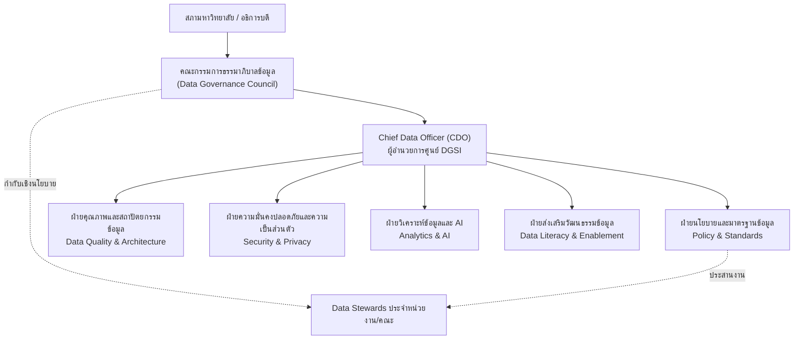

# 🏛️ โครงสร้างองค์กรและธรรมาภิบาล

> ส่วนหนึ่งของ [[00 - ภาพรวมศูนย์ฯ (MOC)]] — ภารกิจที่ 2: การกำหนดพันธกิจและบทบาท

---

## 🗂️ ผังโครงสร้างธรรมาภิบาลข้อมูล

> [!info] 3 ระดับของธรรมาภิบาล
> **เชิงยุทธศาสตร์** (Council) → **เชิงยุทธวิธี** (CDO + ฝ่ายต่าง ๆ) → **เชิงปฏิบัติการ** (Data Stewards ในหน่วยงาน) สอดคล้องโครงสร้าง 3-tier ตาม `#standard/dga` และ `#standard/dama`

---

## 👥 บทบาทหน้าที่หลัก (สอบทานกับ DAMA-DMBOK)

| บทบาท | ความรับผิดชอบหลัก | tag |
|-------|-------------------|-----|
| **Data Governance Council** | อนุมัตินโยบาย จัดลำดับความสำคัญ ชี้ขาดข้อพิพาทข้อมูล | `#role/council` |
| **CDO / ผอ.ศูนย์** | นำยุทธศาสตร์ข้อมูล รายงานต่อผู้บริหารสูงสุด | `#role/cdo` |
| **Data Owner** | เจ้าของข้อมูลเชิงธุรกิจ (มักเป็นหัวหน้าหน่วยงาน) อนุมัติการเข้าถึง | `#role/owner` |
| **Data Steward** | ดูแลคุณภาพ/นิยามข้อมูลในโดเมนของตน | `#role/steward` |
| **Data Custodian** | ดูแลเชิงเทคนิค (IT) จัดเก็บ สำรอง รักษาความปลอดภัย | `#role/custodian` |
| **DPO** | เจ้าหน้าที่คุ้มครองข้อมูลส่วนบุคคลตาม `#standard/pdpa` | `#role/dpo` |

---

## 📊 ตาราง RACI — กระบวนการสำคัญ

> R = Responsible, A = Accountable, C = Consulted, I = Informed

| กิจกรรม | Council | CDO | Data Owner | Steward | Custodian | DPO |
|---------|:---:|:---:|:---:|:---:|:---:|:---:|
| กำหนดนโยบายข้อมูล | A | R | C | C | I | C |
| อนุมัติสิทธิ์เข้าถึงข้อมูล | I | C | A/R | C | R | C |
| จัดทำ Data Catalog/Metadata | I | A | C | R | R | I |
| ตรวจสอบคุณภาพข้อมูล | I | A | C | R | C | I |
| ประเมินผลกระทบความเป็นส่วนตัว (DPIA) | I | C | C | C | C | A/R |
| อนุมัติโครงการ AI/Analytics | A | R | C | I | I | C |
| ตอบสนองเหตุข้อมูลรั่วไหล | I | A | C | I | R | R |

> [!warning] การแยกหน้าที่ (Segregation of Duties)
> ผู้อนุมัติสิทธิ์ (Data Owner) ต้องแยกจากผู้ให้สิทธิ์เชิงเทคนิค (Custodian) เพื่อลดความเสี่ยงการใช้ข้อมูลโดยมิชอบ

---

## 🔗 กลไกการตัดสินใจ

- **ประชุม Council** รายไตรมาส — อนุมัตินโยบาย จัดลำดับโครงการ ทบทวน KPI จาก [[03 - กลไกการกำกับติดตามและตัวชี้วัด]]
- **คณะทำงาน Data Steward** รายเดือน — แก้ปัญหาคุณภาพและนิยามข้อมูล
- **เวทีพิจารณาจริยธรรม AI (AI Ethics Review)** — กลั่นกรองโครงการที่มีความเสี่ยงสูงตามหลักใน [[01 - วิสัยทัศน์ พันธกิจ และค่านิยม]]

> [!note] ข้อสมมติ
> สมมติให้ศูนย์ฯ ขึ้นตรงต่ออธิการบดี โปรดปรับสายการบังคับบัญชาให้สอดคล้องกับโครงสร้างจริงของมหาวิทยาลัย
