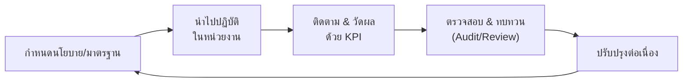

# 📡 กลไกการกำกับติดตามและตัวชี้วัด

> ส่วนหนึ่งของ [[00 - ภาพรวมศูนย์ฯ (MOC)]] — ภารกิจที่ 3: การกำกับติดตาม

---

## 📜 นโยบายและมาตรฐานหลัก

| นโยบาย | สาระสำคัญ | กรอบอ้างอิง |
|--------|-----------|-------------|
| นโยบายธรรมาภิบาลข้อมูล | หลักการ บทบาท และกลไกกำกับโดยรวม | `#standard/dga` `#standard/dama` |
| นโยบายจำแนกชั้นความลับข้อมูล | Public / Internal / Confidential / Restricted | `#standard/dga` |
| นโยบายคุ้มครองข้อมูลส่วนบุคคล | ฐานการประมวลผล สิทธิเจ้าของข้อมูล DPIA | `#standard/pdpa` |
| มาตรฐานคุณภาพข้อมูล | มิติคุณภาพและเกณฑ์ยอมรับ | `#standard/dama` |
| มาตรฐาน Metadata/Data Catalog | นิยามข้อมูลกลาง (Business Glossary) | `#standard/dama` |
| แนวปฏิบัติการใช้ AI อย่างรับผิดชอบ | การประเมินความเสี่ยง อคติ และการอธิบายได้ | `#standard/responsible-ai` |

> [!example] มิติคุณภาพข้อมูล (Data Quality Dimensions)
> ความถูกต้อง (Accuracy) · ความครบถ้วน (Completeness) · ความสอดคล้อง (Consistency) · ความเป็นปัจจุบัน (Timeliness) · ความไม่ซ้ำซ้อน (Uniqueness) · ความถูกต้องตามกติกา (Validity)

---

## 🔄 กระบวนการกำกับติดตาม (Governance Processes)

วงจรกำกับแบบ PDCA — ทบทวนนโยบายอย่างน้อยปีละครั้งผ่าน [[02 - โครงสร้างองค์กรและธรรมาภิบาล#🔗 กลไกการตัดสินใจ|Council]]

---

## 📈 ชุดตัวชี้วัด (KPI Dashboard)

| KPI | นิยาม | เป้าหมาย | ความถี่ | ผู้รับผิดชอบ |
|-----|-------|---------|---------|--------------|
| Data Quality Score | คะแนนคุณภาพข้อมูลชุดสำคัญเฉลี่ย | ≥ 90% | รายเดือน | `#role/steward` |
| Metadata Coverage | สัดส่วนชุดข้อมูลที่มี metadata ครบ | ≥ 80% ใน 18 เดือน | รายไตรมาส | `#role/cdo` |
| PDPA Compliance Rate | สัดส่วนระบบที่ผ่านการประเมิน DPIA | 100% ระบบเสี่ยงสูง | รายไตรมาส | `#role/dpo` |
| Data Incident Count | จำนวนเหตุข้อมูลรั่วไหล/ละเมิด | ลดลง YoY, 0 ระดับร้ายแรง | รายเดือน | `#role/custodian` |
| Data Literacy Coverage | สัดส่วนบุคลากรที่ผ่านอบรม | ≥ 60% ใน 2 ปี | รายไตรมาส | `#role/cdo` |
| Self-service Analytics Adoption | จำนวนผู้ใช้ active บนแพลตฟอร์มข้อมูล | เพิ่ม 20% ต่อปี | รายไตรมาส | Analytics & AI |
| AI Ethics Review Rate | สัดส่วนโครงการ AI ที่ผ่านการกลั่นกรอง | 100% | รายโครงการ | `#role/council` |

> [!tip] นำเสนอผ่าน Dashboard
> ควรจัดทำ Data Governance Dashboard กลางเพื่อให้ Council และผู้บริหารติดตามแบบ near real-time — ดูบริการที่เกี่ยวข้องใน [[04 - แคตตาล็อกงานและบริการ]]

---

## 🛡️ การตรวจสอบและความเสี่ยง

> [!warning] ความเสี่ยงที่ต้องเฝ้าระวัง
> - ข้อมูลส่วนบุคคลรั่วไหล (PDPA breach) → ปรับสูงสุด 5 ล้านบาท + ความเสียหายต่อชื่อเสียง
> - ข้อมูลซ้ำซ้อน/ไม่ตรงกันระหว่างระบบ (Single Source of Truth ไม่ชัด)
> - อคติในโมเดล AI ที่กระทบนักศึกษา/บุคลากร
> - Shadow IT — หน่วยงานเก็บข้อมูลนอกระบบกลาง

- **Internal Audit** ด้านข้อมูลอย่างน้อยปีละครั้ง
- **DPIA** สำหรับทุกระบบ/โครงการที่ประมวลผลข้อมูลส่วนบุคคลความเสี่ยงสูง
- ทะเบียนความเสี่ยงข้อมูล (Data Risk Register) ทบทวนรายไตรมาส
