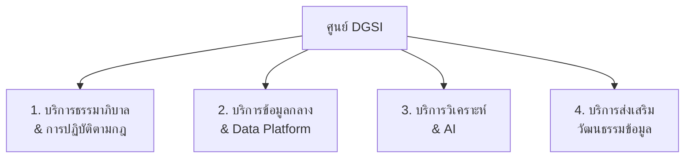

# 🛎️ แคตตาล็อกงานและบริการของศูนย์ฯ

> ส่วนหนึ่งของ [[00 - ภาพรวมศูนย์ฯ (MOC)]] — ภารกิจที่ 4: การพัฒนางาน/บริการ

---

## 📦 ภาพรวมกลุ่มบริการ

---

## 📋 แคตตาล็อกบริการ (Service Catalog)

| รหัส | บริการ | ผู้รับบริการ | คุณค่าที่ส่งมอบ | tag |
|------|--------|--------------|------------------|-----|
| SVC-01 | ให้คำปรึกษานโยบาย/มาตรฐานข้อมูล | คณะ/หน่วยงาน | ปฏิบัติถูกต้อง ลดความเสี่ยง | `#service/governance` |
| SVC-02 | ประเมินผลกระทบความเป็นส่วนตัว (DPIA) | เจ้าของระบบ/โครงการ | ปฏิบัติตาม `#standard/pdpa` | `#service/privacy` |
| SVC-03 | Data Catalog & Business Glossary | ทุกหน่วยงาน | ค้นหาและเข้าใจข้อมูลกลาง | `#service/data-catalog` |
| SVC-04 | บริการข้อมูลกลาง/Data Warehouse ([[11 - สถาปัตยกรรมบูรณาการข้อมูลและบริการ API\|สถาปัตยกรรม]]) | นักวิเคราะห์ ผู้บริหาร ระบบที่พัฒนาเอง | แหล่งข้อมูลเดียวที่เชื่อถือได้ + บริการผ่าน API | `#service/platform` |
| SVC-05 | Self-service BI & Dashboard | ผู้บริหาร หน่วยงาน | ตัดสินใจด้วยข้อมูลแบบทันเวลา | `#service/analytics` |
| SVC-06 | บริการวิเคราะห์ขั้นสูง & โมเดล AI | ผู้บริหาร นักวิจัย | คาดการณ์/เพิ่มประสิทธิภาพ | `#service/ai` |
| SVC-07 | กลั่นกรองจริยธรรม AI (AI Ethics Review) | ทีมพัฒนา AI | ใช้ AI อย่างรับผิดชอบ | `#service/responsible-ai` |
| SVC-08 | อบรม Data Literacy & Workshop | บุคลากรทุกระดับ | ยกระดับทักษะข้อมูล | `#service/enablement` |
| SVC-09 | บริการชุดข้อมูลเพื่อการวิจัย (Research Data) | อาจารย์/นักวิจัย | เข้าถึงข้อมูลปลอดภัย ถูกจริยธรรม | `#service/research` |

> [!warning] บริการบนข้อมูลอ่อนไหว
> SVC-06, SVC-09 ที่เกี่ยวข้องกับข้อมูลนักศึกษา/บุคลากร/ข้อมูลวิจัยในมนุษย์ ต้องผ่าน SVC-02 (DPIA) และการอนุมัติจาก [[02 - โครงสร้างองค์กรและธรรมาภิบาล#👥 บทบาทหน้าที่หลัก (สอบทานกับ DAMA-DMBOK)|Data Owner]] ก่อนเสมอ

---

## 🔁 รูปแบบการให้บริการ (Service Model)

> [!example] ช่องทางและ SLA
> - **ช่องทางรับคำขอ:** ระบบ Service Request / อีเมลกลางศูนย์ฯ
> - **SLA ตัวอย่าง:** ตอบรับภายใน 2 วันทำการ · DPIA ปกติ 10 วันทำการ · คำขอข้อมูลมาตรฐาน 5 วันทำการ
> - **ระดับบริการ:** Tier 1 บริการตนเอง (เอกสาร/อบรม) → Tier 2 ให้คำปรึกษา → Tier 3 พัฒนาร่วม (co-develop)

---

## 🧭 การจัดลำดับการพัฒนาบริการ

บริการพื้นฐาน (SVC-01, 03, 08) เปิดให้บริการในระยะแรก ส่วนบริการขั้นสูง (SVC-06, 07) ทยอยเปิดตามความพร้อม — ดูลำดับเวลาใน [[05 - Roadmap]] และวัดการใช้งานด้วย KPI ใน [[03 - กลไกการกำกับติดตามและตัวชี้วัด#📈 ชุดตัวชี้วัด (KPI Dashboard)|KPI Dashboard]]
