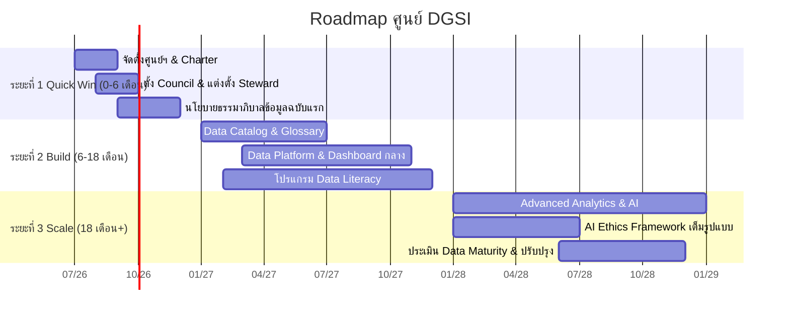

# 🛣️ Roadmap การจัดตั้งและพัฒนาศูนย์ฯ

> ส่วนหนึ่งของ [[00 - ภาพรวมศูนย์ฯ (MOC)]] — แผนขับเคลื่อน 3 ระยะ

---

## 📅 ไทม์ไลน์ภาพรวม

---

## 🟢 ระยะที่ 1 — Quick Win (0–6 เดือน)

> [!tip] เป้าหมาย: วางรากฐานและสร้างแรงส่ง
- [x] จัดตั้งศูนย์ฯ และอนุมัติ [[06 - Charter ฉบับย่อ]]
- [ ] แต่งตั้ง CDO และจัดตั้ง [[02 - โครงสร้างองค์กรและธรรมาภิบาล#🔗 กลไกการตัดสินใจ|Data Governance Council]]
- [ ] แต่งตั้ง Data Steward ประจำหน่วยงานนำร่อง 3–5 หน่วยงาน
- [ ] ประกาศนโยบายธรรมาภิบาลข้อมูลและการจำแนกชั้นความลับฉบับแรก
- [ ] จัดทำทะเบียนข้อมูลส่วนบุคคล (RoPA) ตาม `#standard/pdpa`
- [ ] เปิดบริการพื้นฐาน SVC-01, SVC-08 จาก [[04 - แคตตาล็อกงานและบริการ]]

**ผลลัพธ์ที่คาดหวัง:** มีโครงสร้างกำกับชัดเจน · นโยบายฉบับแรกบังคับใช้ · ปฏิบัติตาม PDPA ขั้นพื้นฐาน

---

## 🟡 ระยะที่ 2 — Build (6–18 เดือน)

> [!tip] เป้าหมาย: สร้างความสามารถและเครื่องมือ
- [ ] พัฒนา Data Catalog & Business Glossary (SVC-03)
- [x] สร้าง Data Platform/Warehouse กลางและ Dashboard ผู้บริหาร (SVC-04, 05)
- [ ] ขับเคลื่อนโปรแกรม Data Literacy ทั่วองค์กร
- [ ] นำมาตรฐานคุณภาพข้อมูลไปใช้กับชุดข้อมูลสำคัญ
- [ ] เริ่มติดตาม [[03 - กลไกการกำกับติดตามและตัวชี้วัด#📈 ชุดตัวชี้วัด (KPI Dashboard)|KPI Dashboard]] เต็มรูปแบบ

**ผลลัพธ์ที่คาดหวัง:** Single Source of Truth · Metadata Coverage ≥ 80% · บุคลากรเข้าถึงข้อมูลแบบ self-service

---

## 🔵 ระยะที่ 3 — Scale (18 เดือนขึ้นไป)

> [!tip] เป้าหมาย: ต่อยอดสู่ความอัจฉริยะอย่างรับผิดชอบ
- [ ] ให้บริการ Advanced Analytics และโมเดล AI (SVC-06)
- [ ] บังคับใช้ AI Ethics Framework และ AI Ethics Review เต็มรูปแบบ (SVC-07)
- [ ] บริการชุดข้อมูลเพื่อการวิจัยที่ปลอดภัยและถูกจริยธรรม (SVC-09)
- [ ] ประเมินระดับวุฒิภาวะข้อมูล (Data Maturity Assessment) และปรับปรุงต่อเนื่อง

**ผลลัพธ์ที่คาดหวัง:** มหาวิทยาลัยตัดสินใจด้วยข้อมูล/AI อย่างมีความรับผิดชอบ บรรลุวิสัยทัศน์ใน [[01 - วิสัยทัศน์ พันธกิจ และค่านิยม]]

---

> [!note] ข้อสมมติด้านเวลา
> ช่วงเวลาเป็นค่าประมาณเริ่มกรกฎาคม 2569 โปรดปรับให้สอดคล้องกับปีงบประมาณและความพร้อมด้านทรัพยากรจริง
