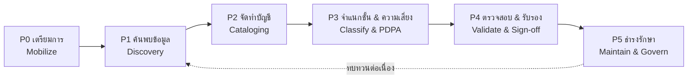

# 🗃️ แผนการจัดทำ Data Inventory (บัญชีข้อมูล)

> ส่วนหนึ่งของ [[00 - ภาพรวมศูนย์ฯ (MOC)]] — ต่อยอดบริการ [[04 - แคตตาล็อกงานและบริการ#📋 แคตตาล็อกบริการ (Service Catalog)|SVC-03 Data Catalog]] และสอดรับ [[05 - Roadmap#🟡 ระยะที่ 2 — Build (6-18 เดือน)|Roadmap ระยะที่ 2]]

> [!info] Data Inventory คืออะไร และทำไมต้องทำ
> บัญชีข้อมูล คือทะเบียนรวมศูนย์ที่บันทึก "องค์กรมีข้อมูลอะไรบ้าง อยู่ที่ไหน ใครเป็นเจ้าของ ชั้นความลับใด ใช้ทำอะไร" เป็น **รากฐานของทุกงานธรรมาภิบาลข้อมูล** — ทั้งการปฏิบัติตาม `#standard/pdpa` (RoPA), การจัดการคุณภาพ `#standard/dama`, และการเปิดให้บริการข้อมูล

---

## 🎯 ปลายทาง (End State)

> [!tip] นิยามความสำเร็จ
> มหาวิทยาลัยมี **บัญชีข้อมูลกลางที่ครบถ้วน เป็นปัจจุบัน และมีเจ้าของชัดเจน** ครอบคลุมข้อมูลสำคัญทุกระบบ จำแนกชั้นความลับและสถานะ PDPA ครบ พร้อมกลไกธำรงรักษาให้ทันสมัยอัตโนมัติ — ใช้เป็นแหล่งอ้างอิงเดียว (Single Source of Truth) สำหรับการกำกับและให้บริการข้อมูล

ตัวชี้วัดปลายทาง (North Star):
- **Inventory Coverage ≥ 95%** ของระบบ/ชุดข้อมูลสำคัญ
- **Ownership Assigned = 100%** (ทุกรายการมี Data Owner/Steward)
- **PDPA Mapping = 100%** ของข้อมูลส่วนบุคคล (เชื่อม RoPA)
- **Freshness ≤ 90 วัน** (ทบทวน/ปรับปรุงรายการภายในรอบที่กำหนด)

---

## 🧭 ภาพรวม 6 ระยะ

| ระยะ | ช่วงเวลา (ประมาณ) | ผลลัพธ์หลัก |
|------|-------------------|-------------|
| P0 เตรียมการ | เดือน 1 | เกณฑ์ ทีม เทมเพลต เครื่องมือ |
| P1 ค้นพบข้อมูล | เดือน 1–3 | รายการแหล่งข้อมูล/ระบบทั้งหมด |
| P2 จัดทำบัญชี | เดือน 2–6 | บัญชีข้อมูลพร้อม metadata |
| P3 จำแนกชั้น & ความเสี่ยง | เดือน 4–7 | ชั้นความลับ + PDPA/RoPA mapping |
| P4 ตรวจสอบ & รับรอง | เดือน 6–8 | บัญชีที่ผ่านการรับรองจาก Owner |
| P5 ธำรงรักษา | เดือน 8+ | กระบวนการอัปเดตต่อเนื่อง |

---

## 🟤 P0 — เตรียมการ (Mobilize)

**ขั้นตอน**
- [ ] กำหนดขอบเขต (เริ่มจากระบบสำคัญ/หน่วยงานนำร่อง 3–5 แห่ง)
- [ ] นิยาม "หน่วยของบัญชี" (Data Asset = ระบบ / ฐานข้อมูล / ชุดข้อมูล / ตาราง)
- [ ] ออกแบบเทมเพลตบัญชีข้อมูล (ดู [[#📋 เทมเพลตบัญชีข้อมูล (Inventory Schema)|schema ด้านล่าง]])
- [ ] กำหนดเกณฑ์จำแนกชั้นความลับ (อ้างอิง [[03 - กลไกการกำกับติดตามและตัวชี้วัด#📜 นโยบายและมาตรฐานหลัก|นโยบายจำแนกชั้นความลับ]])
- [ ] เลือกเครื่องมือ (สเปรดชีตกลาง → **OpenMetadata** เมื่อพร้อม — ดู [[10 - แผนบูรณาการ OpenMetadata (Data Catalog)]])
- [ ] แต่งตั้งทีมและมอบหมาย [[02 - โครงสร้างองค์กรและธรรมาภิบาล#👥 บทบาทหน้าที่หลัก (สอบทานกับ DAMA-DMBOK)|Data Steward]]

**การวัดผล**
| ตัวชี้วัด | เป้าหมาย |
|-----------|---------|
| เทมเพลต & เกณฑ์อนุมัติแล้ว | ครบถ้วน 100% |
| หน่วยงานนำร่องยืนยันเข้าร่วม | ≥ 3 หน่วยงาน |

**เกณฑ์ผ่านระยะ (Exit Criteria):** มีเทมเพลต เกณฑ์ เครื่องมือ และทีมพร้อมเริ่มสำรวจ

---

## 🔵 P1 — ค้นพบข้อมูล (Discovery)

**ขั้นตอน**
- [ ] สำรวจระบบสารสนเทศ ฐานข้อมูล ไฟล์แชร์ และ Shadow IT
- [ ] สัมภาษณ์หน่วยงานเจ้าของกระบวนการเพื่อระบุข้อมูลที่ใช้/ผลิต
- [ ] (ถ้ามีเครื่องมือ) สแกนค้นพบข้อมูลอัตโนมัติ (automated discovery/profiling)
- [ ] จัดทำรายการแหล่งข้อมูลดิบ (Raw Source List)

**การวัดผล**
| ตัวชี้วัด | เป้าหมาย |
|-----------|---------|
| จำนวนแหล่งข้อมูลที่ค้นพบ | บันทึกครบ ไม่ตกหล่นระบบสำคัญ |
| Discovery Coverage (หน่วยงานนำร่อง) | ≥ 90% ของระบบที่รู้จัก |

> [!warning] ระวัง Shadow Data
> ข้อมูลในสเปรดชีตส่วนบุคคล/คลาวด์ส่วนตัวมักถูกมองข้าม แต่เป็นจุดเสี่ยง PDPA สูงสุด — ต้องถามเชิงรุก

**เกณฑ์ผ่านระยะ:** มีรายการแหล่งข้อมูลครบถ้วนของขอบเขตที่กำหนด

---

## 🟢 P2 — จัดทำบัญชี (Cataloging)

**ขั้นตอน**
- [ ] บันทึก metadata แต่ละรายการตามเทมเพลต
- [ ] ระบุ Data Owner / Steward / Custodian ของแต่ละรายการ
- [ ] เชื่อมโยงคำนิยามกับ Business Glossary (SVC-03)
- [ ] ระบุความสัมพันธ์/สายข้อมูล (Data Lineage) เบื้องต้น

**การวัดผล**
| ตัวชี้วัด | เป้าหมาย |
|-----------|---------|
| Metadata Completeness | ฟิลด์บังคับครบ ≥ 90% |
| Ownership Assigned | 100% ของรายการในบัญชี |
| Catalog Coverage | ≥ 80% ของแหล่งที่ค้นพบใน P1 |

**เกณฑ์ผ่านระยะ:** ทุกรายการมี metadata บังคับครบและมีเจ้าของ

---

## 🟡 P3 — จำแนกชั้นและประเมินความเสี่ยง (Classify & PDPA)

**ขั้นตอน**
- [ ] จำแนกชั้นความลับ: Public / Internal / Confidential / Restricted
- [ ] ระบุว่ารายการใดมีข้อมูลส่วนบุคคล/อ่อนไหว ตาม `#standard/pdpa`
- [ ] เชื่อมโยงเข้าทะเบียนกิจกรรมการประมวลผล (RoPA): วัตถุประสงค์ ฐานทางกฎหมาย ระยะเวลาเก็บ
- [ ] ทำเครื่องหมายรายการเสี่ยงสูงเพื่อส่งเข้า [[04 - แคตตาล็อกงานและบริการ#📋 แคตตาล็อกบริการ (Service Catalog)|SVC-02 DPIA]]

**การวัดผล**
| ตัวชี้วัด | เป้าหมาย |
|-----------|---------|
| Classification Coverage | 100% ของรายการในบัญชี |
| PDPA/RoPA Mapping | 100% ของข้อมูลส่วนบุคคล |
| รายการเสี่ยงสูงส่งเข้า DPIA | 100% |

> [!warning] ข้อมูลอ่อนไหวของมหาวิทยาลัย
> ข้อมูลนักศึกษา บุคลากร และข้อมูลวิจัยในมนุษย์ ต้องจัดชั้น Restricted และมีฐานการประมวลผลที่ชัดเจน

**เกณฑ์ผ่านระยะ:** ทุกรายการมีชั้นความลับ และข้อมูลส่วนบุคคลเชื่อม RoPA ครบ

---

## 🟠 P4 — ตรวจสอบและรับรอง (Validate & Sign-off)

**ขั้นตอน**
- [ ] Data Owner ตรวจทานความถูกต้องของรายการในโดเมนตน
- [ ] แก้ไขข้อมูลที่ไม่ตรง/ซ้ำซ้อน (resolve duplicates → Single Source of Truth)
- [ ] รับรองบัญชีอย่างเป็นทางการต่อ [[02 - โครงสร้างองค์กรและธรรมาภิบาล#🔗 กลไกการตัดสินใจ|Council]]
- [ ] เผยแพร่บัญชีให้ผู้ใช้ที่เกี่ยวข้องเข้าถึง

**การวัดผล**
| ตัวชี้วัด | เป้าหมาย |
|-----------|---------|
| Owner Sign-off Rate | 100% ของโดเมน |
| Data Accuracy (จากการสุ่มตรวจ) | ≥ 95% |
| Duplicate/Conflict ที่แก้แล้ว | ≥ 90% |

**เกณฑ์ผ่านระยะ:** บัญชีผ่านการรับรองจากเจ้าของและเผยแพร่ใช้งานได้

---

## 🟣 P5 — ธำรงรักษาและปรับปรุงต่อเนื่อง (Maintain & Govern)

**ขั้นตอน**
- [ ] กำหนดรอบทบทวนบัญชี (เช่น ทุกไตรมาส) และผู้รับผิดชอบ
- [ ] ฝังขั้นตอน "ขึ้นทะเบียนข้อมูลใหม่" เข้ากระบวนการพัฒนาระบบ (by design)
- [ ] ตั้งการแจ้งเตือนรายการที่ค้างปรับปรุงเกินกำหนด (stale)
- [ ] รายงานสถานะบัญชีเข้าสู่ [[03 - กลไกการกำกับติดตามและตัวชี้วัด#📈 ชุดตัวชี้วัด (KPI Dashboard)|KPI Dashboard]]
- [ ] ขยายขอบเขตจากหน่วยงานนำร่องสู่ทั้งมหาวิทยาลัย

**การวัดผล**
| ตัวชี้วัด | เป้าหมาย |
|-----------|---------|
| Inventory Freshness | ≥ 90% ของรายการทบทวนใน ≤ 90 วัน |
| Inventory Coverage (ทั้งองค์กร) | ≥ 95% |
| New Asset Registration Compliance | 100% ของระบบใหม่ |

**เกณฑ์ผ่านระยะ (ปลายทาง):** บัญชีครบถ้วน เป็นปัจจุบันอัตโนมัติ และเป็นแหล่งอ้างอิงเดียวที่เชื่อถือได้

---

## 📋 เทมเพลตบัญชีข้อมูล (Inventory Schema)

> [!example] ฟิลด์มาตรฐานของแต่ละรายการ (สอบทานกับ DAMA-DMBOK & PDPA RoPA)

| ฟิลด์ | คำอธิบาย | บังคับ |
|-------|----------|:---:|
| Asset ID | รหัสอ้างอิงรายการ | ✅ |
| ชื่อชุดข้อมูล | ชื่อที่เข้าใจง่าย | ✅ |
| คำอธิบาย | เนื้อหา/ความหมายของข้อมูล | ✅ |
| ระบบ/แหล่งที่จัดเก็บ | ตำแหน่งจริง (system/DB/location) | ✅ |
| Data Owner | เจ้าของเชิงธุรกิจ | ✅ |
| Data Steward | ผู้ดูแลคุณภาพ/นิยาม | ✅ |
| Data Custodian | ผู้ดูแลเชิงเทคนิค | ✅ |
| ชั้นความลับ | Public/Internal/Confidential/Restricted | ✅ |
| มีข้อมูลส่วนบุคคล? | ใช่/ไม่ + ประเภท (ทั่วไป/อ่อนไหว) | ✅ |
| วัตถุประสงค์การใช้ | (เชื่อม RoPA) | ✅* |
| ฐานทางกฎหมาย | (เชื่อม RoPA ตาม PDPA) | ✅* |
| ระยะเวลาเก็บรักษา | Retention period | ✅* |
| ความถี่ปรับปรุงข้อมูล | real-time/รายวัน/รายเดือน | ⬜ |
| คะแนนคุณภาพ | Data Quality Score | ⬜ |
| Data Lineage | ที่มา/ปลายทางของข้อมูล | ⬜ |
| สถานะ | active / deprecated | ✅ |
| วันที่ทบทวนล่าสุด | สำหรับวัด Freshness | ✅ |

> ✅* = บังคับเฉพาะรายการที่มีข้อมูลส่วนบุคคล

---

## 👥 RACI งานจัดทำ Data Inventory

| กิจกรรม | CDO | Steward | Owner | Custodian | DPO |
|---------|:---:|:---:|:---:|:---:|:---:|
| กำหนดเกณฑ์/เทมเพลต (P0) | A/R | C | C | C | C |
| ค้นพบ & บันทึก (P1–P2) | A | R | C | R | I |
| จำแนกชั้น & PDPA (P3) | A | R | C | I | C/R |
| ตรวจสอบ & รับรอง (P4) | A | C | R | I | C |
| ธำรงรักษา (P5) | A | R | C | R | I |

> [!note] ข้อสมมติ
> ช่วงเวลาเป็นค่าประมาณสำหรับเฟสนำร่อง การขยายทั้งมหาวิทยาลัยจะวนรอบ P1–P5 ซ้ำตามกลุ่มหน่วยงาน — ปรับจำนวนรอบและเวลาให้สอดคล้องกับขนาดองค์กรและทรัพยากรจริง
