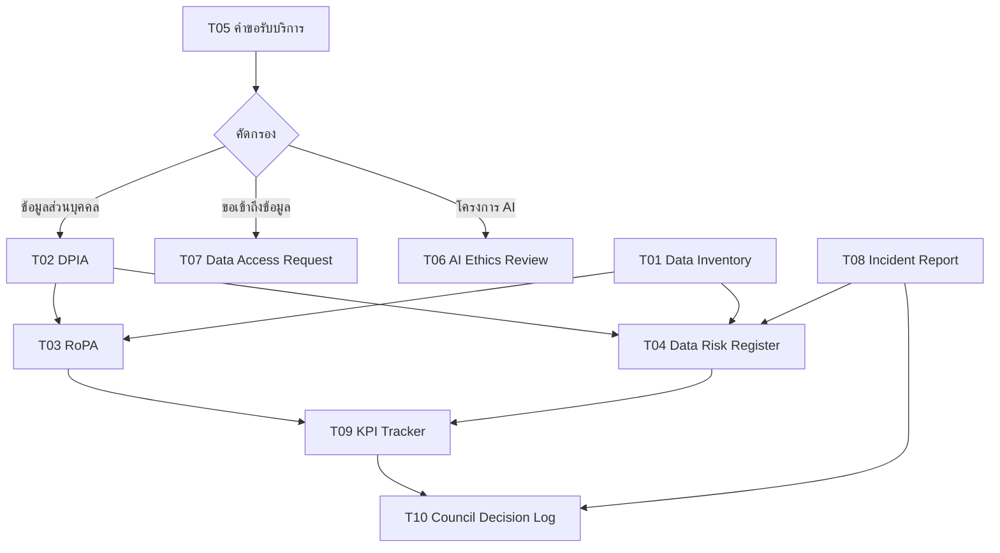

# 🧰 เครื่องมือดำเนินงาน (Operations Toolkit)

> ส่วนหนึ่งของ [[00 - ภาพรวมศูนย์ฯ (MOC)]] — แปลงเอกสารออกแบบ (00–08) ให้เป็น **เครื่องมือพร้อมใช้** สำหรับงานประจำวันของศูนย์ฯ

> [!info] เอกสารนี้คืออะไร
> โน้ตดัชนีที่รวบรวม **แบบฟอร์ม ทะเบียน และเช็กลิสต์** ที่ใช้ลงมือทำจริง (operational artifacts) ซึ่งถูกอ้างถึงตลอดชุดเอกสารออกแบบ แต่ละเครื่องมือออกแบบให้คัดลอกไปใช้ได้ทันที (copy แล้วกรอก) โดยมีฟิลด์มาตรฐาน แถวตัวอย่าง และลิงก์กลับไปยังนโยบาย/มาตรฐานต้นทาง

---

## 🗂️ ดัชนีเครื่องมือ (Toolkit Index)

| รหัส | เครื่องมือ | ใช้เมื่อใด | เชื่อมโยงต้นทาง |
|------|-----------|-----------|-----------------|
| T01 | [[T01 - ทะเบียนบัญชีข้อมูล (Data Inventory Register)]] | บันทึก/ปรับปรุงบัญชีข้อมูลกลาง | [[08 - แผนการจัดทำ Data Inventory]] |
| T02 | [[T02 - แบบประเมินผลกระทบความเป็นส่วนตัว (DPIA)]] | ระบบ/โครงการที่มีข้อมูลส่วนบุคคลเสี่ยงสูง | SVC-02 · `#standard/pdpa` |
| T03 | [[T03 - ทะเบียนกิจกรรมการประมวลผลข้อมูล (RoPA)]] | ขึ้นทะเบียนกิจกรรมประมวลผลตาม PDPA | `#standard/pdpa` |
| T04 | [[T04 - ทะเบียนความเสี่ยงข้อมูล (Data Risk Register)]] | บันทึก/ทบทวนความเสี่ยงรายไตรมาส | [[03 - กลไกการกำกับติดตามและตัวชี้วัด]] |
| T05 | [[T05 - แบบฟอร์มคำขอรับบริการ (Service Request)]] | หน่วยงานขอรับบริการจากศูนย์ฯ | [[04 - แคตตาล็อกงานและบริการ]] |
| T06 | [[T06 - แบบกลั่นกรองจริยธรรม AI (AI Ethics Review)]] | ก่อนเริ่ม/ปล่อยโครงการ AI/Analytics | SVC-07 · `#standard/responsible-ai` |
| T07 | [[T07 - แบบฟอร์มคำขอเข้าถึงข้อมูล (Data Access Request)]] | ขอสิทธิ์เข้าถึงข้อมูล | [[02 - โครงสร้างองค์กรและธรรมาภิบาล#📊 ตาราง RACI — กระบวนการสำคัญ\|RACI]] |
| T08 | [[T08 - แบบบันทึกและตอบสนองเหตุข้อมูลรั่วไหล (Data Incident Report)]] | เกิดเหตุข้อมูลรั่วไหล/ละเมิด | [[03 - กลไกการกำกับติดตามและตัวชี้วัด#🛡️ การตรวจสอบและความเสี่ยง\|ความเสี่ยง]] |
| T09 | [[T09 - แดชบอร์ดติดตาม KPI (KPI Tracker)]] | บันทึกค่าตัวชี้วัดรายเดือน/ไตรมาส | [[03 - กลไกการกำกับติดตามและตัวชี้วัด#📈 ชุดตัวชี้วัด (KPI Dashboard)\|KPI Dashboard]] |
| T10 | [[T10 - วาระและบันทึกมติการประชุม Council (Council Agenda & Decision Log)]] | ประชุม Council รายไตรมาส | [[02 - โครงสร้างองค์กรและธรรมาภิบาล#🔗 กลไกการตัดสินใจ\|กลไกการตัดสินใจ]] |

---

## 🔁 เครื่องมือแต่ละตัวเชื่อมโยงกระบวนการอย่างไร

---

## 📐 หลักการใช้งานชุดเครื่องมือ

> [!tip] วิธีใช้
> 1. **คัดลอก (copy)** ไฟล์เครื่องมือที่ต้องการเป็นรายการใหม่ ตั้งชื่อตามรูปแบบรหัสที่กำหนดในเครื่องมือนั้น
> 2. **กรอกฟิลด์บังคับ** ให้ครบก่อนเสนอผู้อนุมัติ
> 3. **เชื่อมโยง (link)** กลับไปยังรายการที่เกี่ยวข้อง เช่น Asset ID ใน [[T01 - ทะเบียนบัญชีข้อมูล (Data Inventory Register)]]
> 4. **ติดแท็กสถานะ** เพื่อให้ค้นและทำ Dashboard ด้วย Dataview ได้

> [!note] ข้อสมมติ
> เครื่องมือชุดนี้เป็นเทมเพลตกลางบนสมมติฐานทั่วไปของมหาวิทยาลัยไทย — ปรับฟิลด์ เกณฑ์ และผู้อนุมัติให้สอดคล้องกับระเบียบและบริบทจริงขององค์กรก่อนบังคับใช้
</content>
</invoke>
