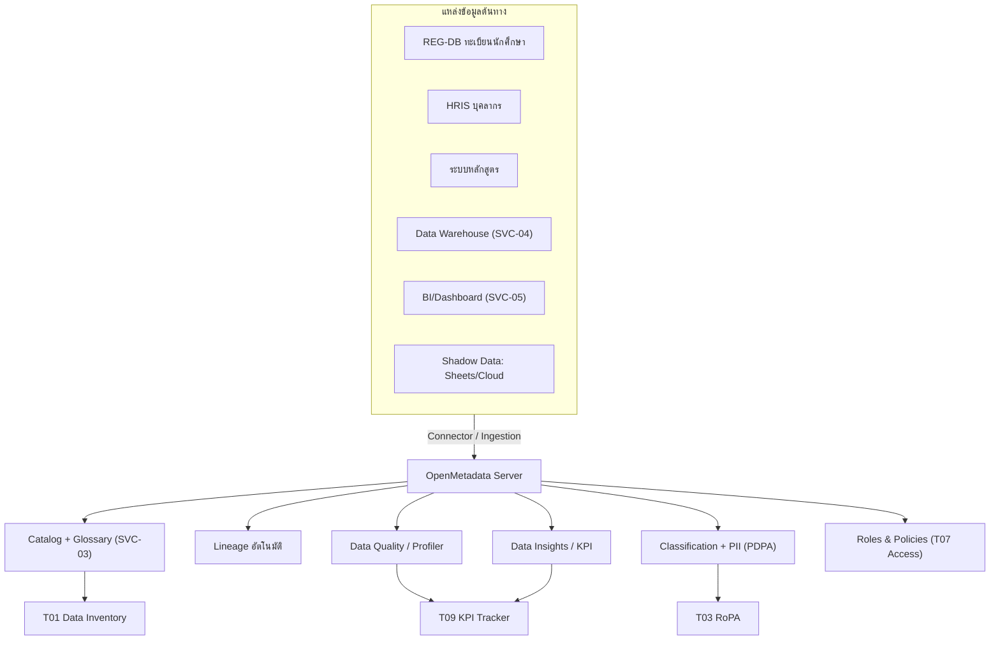
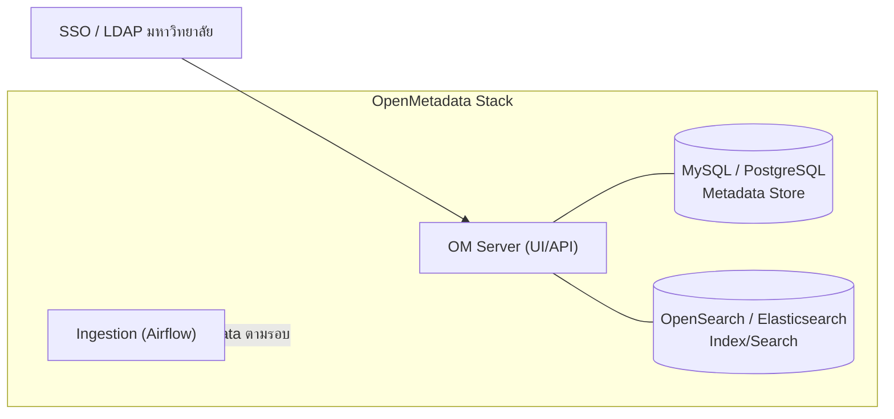
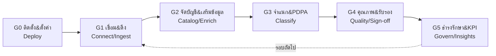

# 🧩 แผนบูรณาการ OpenMetadata (Data Catalog Platform)

> ส่วนหนึ่งของ [[00 - ภาพรวมศูนย์ฯ (MOC)]] — เลือกใช้ **OpenMetadata** เป็นเครื่องมือจริงสำหรับบริการ [[04 - แคตตาล็อกงานและบริการ#📋 แคตตาล็อกบริการ (Service Catalog)\|SVC-03 Data Catalog & Business Glossary]] เพื่อ "ลงเครื่องมือ" ให้กับแผน [[08 - แผนการจัดทำ Data Inventory]] และชุดเครื่องมือ [[09 - เครื่องมือดำเนินงาน (Operations Toolkit)]]

> [!info] เอกสารนี้คืออะไร
> แผนดำเนินการนำ **OpenMetadata** (แพลตฟอร์ม metadata แบบโอเพนซอร์ส) มาใช้เป็นแกนกลางของ Data Catalog — โดย **บูรณาการ** เข้ากับสิ่งที่ออกแบบไว้แล้ว ทั้งเทมเพลตบัญชีข้อมูล (Inventory Schema), เครื่องมือ T01–T10, นโยบายจำแนกชั้นความลับ/PDPA และชุด KPI เอกสารนี้ตอบ 3 คำถาม: **(1) แมปอย่างไร** (เครื่องมือเดิม ↔ ฟีเจอร์ OpenMetadata) · **(2) ติดตั้งอย่างไร** (สถาปัตยกรรม) · **(3) ทำเป็นระยะอย่างไร** (แผนงาน P0–P5)

> [!tip] ทำไมเลือก OpenMetadata
> ครอบคลุมเสาหลักของ [[03 - กลไกการกำกับติดตามและตัวชี้วัด#📜 นโยบายและมาตรฐานหลัก\|มาตรฐาน Metadata/Data Catalog]] ในเครื่องมือเดียว — **Catalog + Business Glossary + Lineage + Data Quality + Classification(PII) + RBAC + Data Insights/KPI** — โอเพนซอร์ส (ลดข้อจำกัดงบประมาณ), ใช้ API/Connector มาตรฐาน (ลด vendor lock-in) และมีกลไก Custom Properties ที่รองรับฟิลด์ PDPA/RoPA ของเราได้

---

## 🎯 เป้าหมายของการบูรณาการ

> [!tip] นิยามความสำเร็จ
> OpenMetadata กลายเป็น **แหล่งอ้างอิงเดียว (Single Source of Truth)** ของบัญชีข้อมูล แทนการกรอกสเปรดชีตด้วยมือ — โดยรายการในทะเบียน [[เครื่องมือ/T01 - ทะเบียนบัญชีข้อมูล (Data Inventory Register)\|T01]] ถูก **ดึงอัตโนมัติ (auto-ingest)** จากระบบต้นทาง, จำแนกชั้น/PII กึ่งอัตโนมัติ, และส่งค่าตัวชี้วัดเข้า [[03 - กลไกการกำกับติดตามและตัวชี้วัด#📈 ชุดตัวชี้วัด (KPI Dashboard)\|KPI Dashboard]] ได้โดยตรง

สอดรับตัวชี้วัดปลายทางของ [[08 - แผนการจัดทำ Data Inventory#🎯 ปลายทาง (End State)\|Data Inventory End State]]:

| North Star | กลไกใน OpenMetadata ที่ทำให้บรรลุ |
|------------|------------------------------------|
| Inventory Coverage ≥ 95% | Auto-ingestion ผ่าน connector + Data Insights (Asset coverage) |
| Ownership Assigned = 100% | Owners (Team/User) + กฎ "ห้าม publish ถ้าไม่มี owner" |
| PDPA Mapping = 100% | Auto PII Classification + Custom Property `RoPA Ref` |
| Freshness ≤ 90 วัน | Ingestion ตามรอบ + Data Insights (Freshness) + แจ้งเตือน stale |

---

## 🗺️ OpenMetadata เชื่อมกับสถาปัตยกรรมบริการอย่างไร

> [!note] ขอบเขตของ OpenMetadata vs. เครื่องมืออื่น
> OpenMetadata ทำหน้าที่ **catalog/quality/lineage/PII/insights** — ส่วนที่เป็น "การตัดสินใจเชิงนโยบาย" (DPIA T02, ความเสี่ยง T04, มติ Council T10) ยังคงอยู่ในเครื่องมือ/กระบวนการเดิม แต่ **เชื่อมโยง (link)** ผ่านฟิลด์อ้างอิงและแท็ก ไม่ย้ายเข้ามาทั้งหมด

---

## 🔗 การแมปเครื่องมือเดิม ↔ ฟีเจอร์ OpenMetadata

| เครื่องมือ/แผนเดิม | ฟีเจอร์ OpenMetadata | รูปแบบการบูรณาการ |
|---------------------|----------------------|--------------------|
| [[08 - แผนการจัดทำ Data Inventory#📋 เทมเพลตบัญชีข้อมูล (Inventory Schema)\|Inventory Schema]] | Entity (Table/Topic/Container) + **Custom Properties** | แมปฟิลด์ → ดูตารางด้านล่าง |
| [[เครื่องมือ/T01 - ทะเบียนบัญชีข้อมูล (Data Inventory Register)\|T01 Data Inventory]] | Catalog (Tables/Datasets) | OM เป็นระบบหลัก; T01 กลายเป็น "view/รายงาน export" |
| [[04 - แคตตาล็อกงานและบริการ#📋 แคตตาล็อกบริการ (Service Catalog)\|SVC-03 Glossary]] | **Business Glossary** + Terms | นิยามกลาง + ผูกคำกับ asset (semantic) |
| นโยบายจำแนกชั้นความลับ | **Classification: `Tier`/`Confidentiality`** | Tag: Public / Internal / Confidential / Restricted |
| `#standard/pdpa` (ข้อมูลส่วนบุคคล) | **Auto PII Classification** + Tags `PII.Sensitive` | จำแนกอัตโนมัติ + ยืนยันโดย Steward |
| [[เครื่องมือ/T03 - ทะเบียนกิจกรรมการประมวลผลข้อมูล (RoPA)\|T03 RoPA]] | Custom Property `RoPA Ref` + Glossary "Processing Activity" | ผูก asset ↔ กิจกรรมประมวลผล |
| [[เครื่องมือ/T04 - ทะเบียนความเสี่ยงข้อมูล (Data Risk Register)\|T04 Risk]] | Custom Property `Risk Ref` + Tag `Risk.High` | ทำเครื่องหมาย asset เสี่ยงสูง |
| [[เครื่องมือ/T07 - แบบฟอร์มคำขอเข้าถึงข้อมูล (Data Access Request)\|T07 Access Request]] | **Roles & Policies** + Request Access | คำขอ/อนุมัติสิทธิ์ในตัว |
| [[เครื่องมือ/T09 - แดชบอร์ดติดตาม KPI (KPI Tracker)\|T09 KPI Tracker]] | **Data Insights & KPIs** | ดึง metric อัตโนมัติ → ส่งเข้า Dashboard |
| [[02 - โครงสร้างองค์กรและธรรมาภิบาล\|บทบาท CDO/Steward/Owner/Custodian/DPO]] | **Teams & Roles** | โครงสร้างทีมสะท้อน RACI |

### 📐 แมปฟิลด์ Inventory Schema → OpenMetadata

| ฟิลด์ (Schema) | กลไกใน OpenMetadata | บังคับ |
|-----------------|----------------------|:---:|
| Asset ID | Fully Qualified Name (FQN) อัตโนมัติ + Custom Property `Legacy Asset ID` | ✅ |
| ชื่อชุดข้อมูล / คำอธิบาย | Display Name / Description (รองรับ AI auto-description) | ✅ |
| ระบบ/แหล่งจัดเก็บ | Service + Database + Schema (มาจาก connector) | ✅ |
| Data Owner | Owner (Team หรือ User) | ✅ |
| Data Steward | Custom Property `Data Steward` | ✅ |
| Data Custodian | Custom Property `Data Custodian` | ✅ |
| ชั้นความลับ | Classification Tag `Tier.*` (Public→Restricted) | ✅ |
| มีข้อมูลส่วนบุคคล? | Tag `PII.Sensitive` / `PII.NonSensitive` (auto + ยืนยัน) | ✅ |
| วัตถุประสงค์ / ฐานกฎหมาย / Retention | Custom Properties (ผูก [[เครื่องมือ/T03 - ทะเบียนกิจกรรมการประมวลผลข้อมูล (RoPA)\|RoPA]]) | ✅* |
| ความถี่ปรับปรุง | Custom Property `Update Frequency` / มาจาก profiler | ⬜ |
| คะแนนคุณภาพ | **Data Quality Test Suite + Profiler** (คำนวณอัตโนมัติ) | ⬜ |
| Data Lineage | **Lineage** (ingest อัตโนมัติจาก query/pipeline) | ⬜ |
| สถานะ (active/deprecated) | Tag `Status.Deprecated` / Lifecycle | ✅ |
| วันที่ทบทวนล่าสุด | Custom Property `Last Reviewed` + Data Insights Freshness | ✅ |

> ✅* บังคับเฉพาะ asset ที่ติดแท็ก PII

---

## 🏗️ สถาปัตยกรรมการติดตั้ง (Deployment)

> [!example] ตัวเลือกการ deploy
> - **เฟสนำร่อง (POC):** Docker Compose บนเซิร์ฟเวอร์เดียว — ติดตั้งเร็ว เหมาะทดสอบ connector 3–5 ระบบ
> - **เฟส Production:** Kubernetes + Helm chart — รองรับ HA, สำรองข้อมูล, แยก ingestion worker
> - **ความปลอดภัย:** เชื่อม **SSO/LDAP** ของมหาวิทยาลัย (Google/Azure AD/SAML), ใช้ HTTPS, จำกัดสิทธิ์ด้วย Roles & Policies, สำรอง metadata DB รายวัน

> [!warning] ข้อกำหนดก่อนติดตั้ง (Prerequisites)
> - สิทธิ์ **read-only** บัญชีบริการสำหรับเชื่อม connector แต่ละระบบต้นทาง (REG-DB, HRIS, DW, BI)
> - ทรัพยากรขั้นต่ำ POC: ~4 vCPU / 16 GB RAM / 100 GB disk
> - การอนุมัติด้านความมั่นคงปลอดภัยให้ OM เข้าถึง metadata (ไม่ดึงข้อมูลจริง เน้น schema/sample เท่าที่จำเป็นต่อ profiling)

---

## 🧭 แผนดำเนินการเป็นระยะ (P0–P5)

> ออกแบบให้ **ขนานกับ 6 ระยะของ** [[08 - แผนการจัดทำ Data Inventory#🧭 ภาพรวม 6 ระยะ\|แผน Data Inventory]] และอยู่ใน [[05 - Roadmap#🟡 ระยะที่ 2 — Build (6-18 เดือน)\|Roadmap ระยะที่ 2 (Data Catalog 2027-01, ~6 เดือน)]]

### 🟤 G0 — ติดตั้งและตั้งค่ารากฐาน (จับคู่ P0)
- [ ] Deploy OpenMetadata (Docker Compose สำหรับ POC) + เชื่อม SSO/LDAP
- [ ] สร้าง **Teams & Roles** สะท้อน RACI: CDO / Steward / Owner / Custodian / DPO
- [ ] สร้าง **Custom Properties** ตามตารางแมปฟิลด์ (Steward, Custodian, RoPA Ref, Last Reviewed, Legacy Asset ID …)
- [ ] สร้าง **Classification** `Tier` (Public/Internal/Confidential/Restricted) และ `PII`
- [ ] ตั้งโครง **Glossary** เริ่มต้น (คำศัพท์กลางของมหาวิทยาลัย)
- **Exit:** ระบบพร้อม, ทีม/บทบาท/ฟิลด์/แท็ก ครบ, ทดสอบ login ด้วย SSO ได้

### 🔵 G1 — เชื่อมต่อและดึง metadata (จับคู่ P1 Discovery)
- [ ] ติดตั้ง Connector ระบบนำร่อง 3–5 ระบบ (REG-DB, HRIS, ระบบหลักสูตร, DW)
- [ ] ตั้ง Ingestion ตามรอบ (metadata + usage) เพื่อ auto-discovery
- [ ] บันทึก **Shadow Data** ด้วยตนเองผ่าน UI/API (Sheets/Cloud ที่ connector เข้าไม่ถึง)
- **Exit:** asset ของระบบนำร่องปรากฏใน catalog ครบ ไม่ตกหล่นระบบสำคัญ

### 🟢 G2 — จัดบัญชีและเสริมข้อมูล (จับคู่ P2 Cataloging)
- [ ] กำหนด **Owner** ทุก asset (กฎ: ไม่มี owner = ยังไม่ publish)
- [ ] กรอก Steward/Custodian (custom property) + คำอธิบาย (ใช้ AI ช่วยร่าง แล้ว Steward ยืนยัน)
- [ ] ผูก asset เข้ากับ **Glossary terms** (SVC-03)
- [ ] เปิด **Lineage** อัตโนมัติจาก query/pipeline
- **Exit:** Metadata Completeness ≥ 90%, Ownership = 100% ของ asset นำร่อง

### 🟡 G3 — จำแนกชั้นและ PDPA (จับคู่ P3 Classify)
- [ ] เปิด **Auto PII Classification** → Steward ทบทวน/ยืนยันแท็ก `PII.*`
- [ ] ติดแท็ก **Tier** ชั้นความลับทุก asset
- [ ] กรอก `RoPA Ref` ผูก [[เครื่องมือ/T03 - ทะเบียนกิจกรรมการประมวลผลข้อมูล (RoPA)\|RoPA]] สำหรับ asset ที่เป็นข้อมูลส่วนบุคคล
- [ ] ทำเครื่องหมาย asset เสี่ยงสูง (`Risk.High`) → ส่งเข้า [[เครื่องมือ/T02 - แบบประเมินผลกระทบความเป็นส่วนตัว (DPIA)\|DPIA T02]]
- **Exit:** Classification Coverage 100%, PDPA/RoPA mapping 100% ของข้อมูลส่วนบุคคล

### 🟠 G4 — คุณภาพข้อมูลและรับรอง (จับคู่ P4 Validate)
- [ ] ตั้ง **Profiler + Test Suites** สำหรับชุดข้อมูลสำคัญ → ได้ Data Quality Score อัตโนมัติ
- [ ] Data Owner ทบทวน/อนุมัติ asset ในโดเมนตน (workflow ใน OM)
- [ ] แก้ duplicates/conflicts → ยืนยัน Single Source of Truth
- [ ] เสนอรับรองบัญชีต่อ [[02 - โครงสร้างองค์กรและธรรมาภิบาล#🔗 กลไกการตัดสินใจ\|Council]] (อ้างอิง [[เครื่องมือ/T10 - วาระและบันทึกมติการประชุม Council (Council Agenda & Decision Log)\|T10]])
- **Exit:** Owner Sign-off 100% โดเมนนำร่อง, Data Quality ชุดสำคัญ ≥ 90%

### 🟣 G5 — ธำรงรักษาและ KPI (จับคู่ P5 Maintain)
- [ ] เปิด **Data Insights & KPIs**: Metadata Coverage, Freshness, Quality, PII Coverage
- [ ] เชื่อมค่าเข้า [[03 - กลไกการกำกับติดตามและตัวชี้วัด#📈 ชุดตัวชี้วัด (KPI Dashboard)\|KPI Dashboard]] / [[เครื่องมือ/T09 - แดชบอร์ดติดตาม KPI (KPI Tracker)\|T09]]
- [ ] ตั้ง **แจ้งเตือน** asset ที่ stale เกิน 90 วัน และ asset ใหม่ที่ไม่มี owner
- [ ] ฝัง "ขึ้นทะเบียนข้อมูลใหม่ by design" เข้ากระบวนการพัฒนาระบบ (ingestion อัตโนมัติ)
- [ ] ขยาย connector จากระบบนำร่องสู่ทั้งมหาวิทยาลัย
- **Exit:** บัญชีเป็นปัจจุบันอัตโนมัติ, KPI ไหลเข้า dashboard, ขยายขอบเขตต่อเนื่อง

---

## 📊 OpenMetadata เติมเต็ม KPI ที่ออกแบบไว้อย่างไร

| KPI (จาก [[03 - กลไกการกำกับติดตามและตัวชี้วัด#📈 ชุดตัวชี้วัด (KPI Dashboard)\|KPI Dashboard]]) | แหล่งใน OpenMetadata |
|------|----------------------|
| Data Quality Score | Test Suites + Profiler (อัตโนมัติ) |
| Metadata Coverage | Data Insights — Description/Owner coverage |
| PDPA Compliance Rate | PII tag coverage + `RoPA Ref` filled |
| Data Incident Count | ผูกจาก [[เครื่องมือ/T08 - แบบบันทึกและตอบสนองเหตุข้อมูลรั่วไหล (Data Incident Report)\|T08]] (manual) — OM ช่วยระบุ asset ที่กระทบ |
| Self-service Analytics Adoption | Usage/Activity analytics ใน OM |

---

## 👥 RACI การบูรณาการ OpenMetadata

| กิจกรรม | CDO | Steward | Owner | Custodian/IT | DPO |
|---------|:---:|:---:|:---:|:---:|:---:|
| ติดตั้ง/ตั้งค่าระบบ (G0) | A | C | I | R | C |
| เชื่อม connector & ingest (G1) | A | C | C | R | I |
| จัดบัญชี/owner/glossary (G2) | A | R | R | C | I |
| จำแนกชั้น & PDPA (G3) | A | R | C | I | C/R |
| คุณภาพ & รับรอง (G4) | A | R | R | C | C |
| KPI & ธำรงรักษา (G5) | A | R | C | R | I |

---

## ⚠️ ความเสี่ยงและการรับมือ

| ความเสี่ยง | การรับมือ |
|-----------|-----------|
| Connector เข้าถึงข้อมูลจริง/อ่อนไหวเกินจำเป็น | ใช้บัญชี read-only, จำกัด sampling, ปิด sample data สำหรับ asset Restricted |
| Auto PII จำแนกผิด (false +/−) | บังคับ Steward ทบทวนก่อน publish — ไม่เชื่ออัตโนมัติ 100% |
| Shadow Data ที่ connector เข้าไม่ถึง | กระบวนการลงทะเบียนด้วยมือ + ถามเชิงรุก (ตาม P1) |
| ผูกขาดความรู้ที่ทีม IT | จัดทำ runbook + อบรม Steward (เชื่อม SVC-08 Data Literacy) |
| ข้อมูล metadata ไม่ถูกสำรอง | สำรอง MySQL/PostgreSQL + ดัชนี search รายวัน |

> [!note] ข้อสมมติ
> เอกสารนี้สมมติว่ายังไม่มี Data Warehouse กลางครบทุกระบบ — ในเฟสแรก OpenMetadata เชื่อมตรงกับระบบต้นทางนำร่องก่อน แล้วจึงเชื่อม DW/BI (SVC-04/05) เมื่อพร้อม โปรดปรับ connector, รอบ ingestion และทรัพยากรให้ตรงกับสภาพแวดล้อมจริงของมหาวิทยาลัย

---

## ✅ เช็กลิสต์ส่งมอบ (Definition of Done)

- [ ] OpenMetadata ใช้งานได้ผ่าน SSO และสำรองข้อมูลแล้ว
- [ ] Teams/Roles/Custom Properties/Classification/Glossary ตั้งครบตาม G0
- [ ] ระบบนำร่อง 3–5 ระบบ ingest เข้า catalog แล้ว (Ownership 100%)
- [ ] ทุก asset มี Tier + สถานะ PII; ข้อมูลส่วนบุคคลผูก RoPA ครบ
- [ ] Profiler/Test Suite ทำงานบนชุดข้อมูลสำคัญ และมี Data Quality Score
- [ ] Data Insights/KPI เชื่อมเข้า [[03 - กลไกการกำกับติดตามและตัวชี้วัด#📈 ชุดตัวชี้วัด (KPI Dashboard)\|KPI Dashboard]]
- [ ] runbook + คู่มือ Steward และแผนขยายสู่ทั้งมหาวิทยาลัยจัดทำแล้ว
