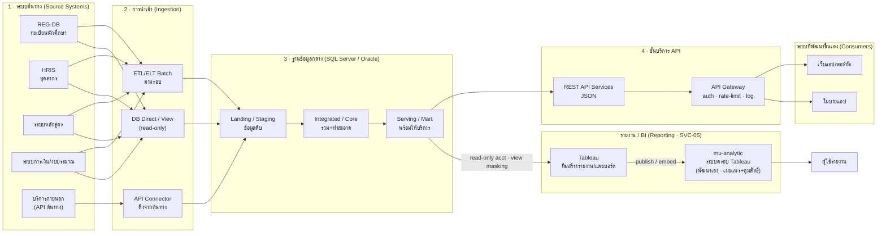
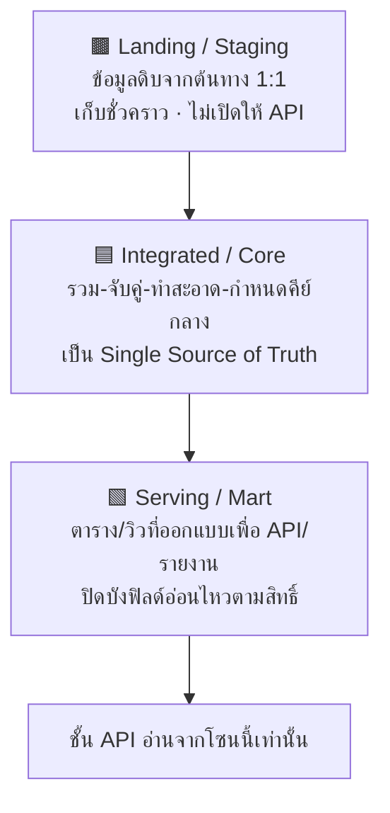
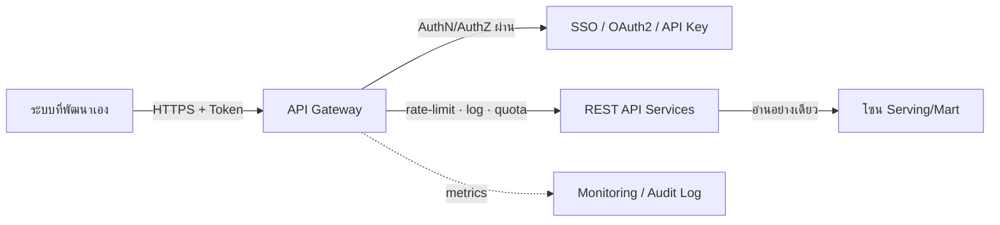
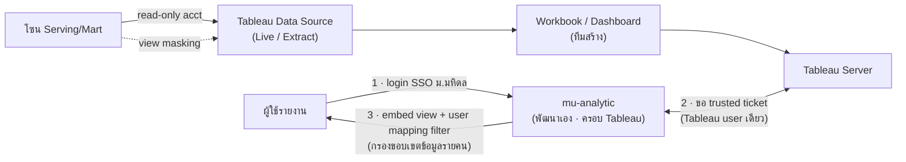

# 🔌 สถาปัตยกรรมบูรณาการข้อมูลและบริการ API

> ส่วนหนึ่งของ [[00 - ภาพรวมศูนย์ฯ (MOC)]] — ลงลึก **สถานะปัจจุบัน** ของบริการ [[04 - แคตตาล็อกงานและบริการ#📋 แคตตาล็อกบริการ (Service Catalog)\|SVC-04 บริการข้อมูลกลาง/Data Warehouse]] ในมุมเทคนิค: ทีมเชื่อมข้อมูลจาก**ระบบต้นทาง** → รวมเป็น**ฐานข้อมูลกลาง** → เปิด**บริการผ่าน REST API** ให้ระบบที่พัฒนาขึ้นเอง และ**ต่อตรงให้ Tableau** ทำรายงาน/แดชบอร์ด

> [!info] เอกสารนี้คืออะไร
> เอกสารบันทึก **สถาปัตยกรรมที่ใช้งานจริง ณ ปัจจุบัน** ของสายงานบูรณาการข้อมูล (Data Integration) — ครอบคลุม 4 ชั้น: **(1) แหล่งต้นทาง → (2) การนำเข้า (Ingestion) → (3) ฐานข้อมูลกลาง → (4) ชั้นบริการ** ที่มี **2 ช่องทางบริโภคข้อมูล**: (ก) **REST API** สำหรับระบบที่พัฒนาเอง และ (ข) **Tableau ต่อ DB กลางตรง** ทำรายงาน แล้วเผยแพร่ผ่าน **mu-analytic** (ระบบพัฒนาเองที่ครอบ Tableau) พร้อมวางทับด้วย**ธรรมาภิบาล** (PDPA, ชั้นความลับ, สิทธิ์เข้าถึง, lineage, คุณภาพ) ให้สอดคล้องกับกรอบของศูนย์ฯ และระบุ **ช่องว่าง (gap) ที่ต้องปิด** เพื่อยกระดับเป็น Trusted Data Platform

> [!note] ความสัมพันธ์กับเอกสาร 10 (OpenMetadata)
> เอกสาร [[10 - แผนบูรณาการ OpenMetadata (Data Catalog)]] เคยตั้งข้อสมมติว่า "ยังไม่มี DW กลางครบทุกระบบ" — เอกสารนี้คือ **ภาพสถานะจริงที่ก้าวหน้ากว่านั้น**: มีฐานข้อมูลกลาง (SQL Server/Oracle) และ API ทำงานแล้ว ดังนั้น OpenMetadata ในเฟสถัดไปควรตั้ง **Connector ตรงกับฐานข้อมูลกลาง** เป็นหลัก และดึง **Lineage ต้นทาง → กลาง → API** อัตโนมัติ

---

## 🧱 ภาพรวมสถาปัตยกรรม (Current-State Architecture)

> [!tip] หลักการออกแบบ (Design Principles)
> **แยกชั้นชัดเจน (Layered)** · **อ่านอย่างเดียวจากต้นทาง (Read-only at source)** · **ฐานกลางเป็นแหล่งอ้างอิงเดียว (Single Source of Truth)** · **บริการผ่าน API ไม่ให้ต่อ DB ตรง (API-first / no direct DB to consumers)** · **มีธรรมาภิบาลฝังในทุกชั้น (Governance by design)**
>
> **ข้อยกเว้นที่กำกับไว้ (Governed exception):** เครื่องมือ BI อย่าง **Tableau ต่อโซน Serving/Mart โดยตรง** ได้ — แต่ต้องผ่าน **บัญชี read-only เฉพาะ** + **view ที่ปิดบังฟิลด์อ่อนไหว** เท่านั้น (ไม่แตะ landing/core และไม่ใช้บัญชีของระบบอื่น) ดู [[#5️⃣ ชั้นรายงาน / BI (Tableau ต่อ DB กลางตรง → เผยแพร่ผ่าน mu-analytic)]]

---

## 1️⃣ ชั้นแหล่งต้นทาง + วิธีนำเข้า (Ingestion Patterns)

ปัจจุบันทีมใช้ **3 รูปแบบผสมกัน** ตามความพร้อมและข้อจำกัดของแต่ละระบบต้นทาง:

| รูปแบบ | เหมาะกับ | ความถี่ | ข้อดี | ข้อควรระวัง / ธรรมาภิบาล |
|--------|----------|---------|-------|--------------------------|
| **ETL/ELT Batch** | ระบบฐานข้อมูลที่ดึงเป็นชุดได้ (REG-DB, HRIS, การเงิน) | รายวัน/รายชั่วโมงตามรอบ | ควบคุมรอบได้ ทำ transform/ทำสะอาดครบ | ต้องมี **watermark/incremental** กันดึงซ้ำทั้งก้อน · log ทุกรอบ |
| **API ของต้นทาง** | บริการภายนอก/ระบบที่เปิด API ให้ | ตามรอบ/ตามเหตุการณ์ | ไม่แตะ DB ต้นทางตรง ลดภาระระบบ | จัดการ **token/secret** ใน vault · retry + backoff · เพดาน rate ของต้นทาง |
| **ต่อ DB ตรง / View (read-only)** | ระบบที่อนุญาตเชื่อมตรง ใช้ข้อมูลสด | เรียลไทม์เมื่อ query | ได้ข้อมูลล่าสุดทันที ไม่ต้องคัดลอก | ใช้ **บัญชี read-only** + View จำกัดคอลัมน์ · เสี่ยงกระทบ performance ต้นทาง |

> [!warning] กฎเหล็กการเชื่อมต้นทาง
> - เชื่อมด้วย **บัญชีบริการสิทธิ์ read-only เท่านั้น** แยกบัญชีต่อระบบ (ไล่ที่มาได้)
> - ระบบต้นทางที่มีข้อมูลส่วนบุคคล ต้องผ่าน [[เครื่องมือ/T07 - แบบฟอร์มคำขอเข้าถึงข้อมูล (Data Access Request)\|T07 Data Access Request]] และอนุมัติโดย [[02 - โครงสร้างองค์กรและธรรมาภิบาล#👥 บทบาทหน้าที่หลัก (สอบทานกับ DAMA-DMBOK)\|Data Owner]] ก่อนต่อ
> - ทุก pipeline ต้องบันทึกใน [[เครื่องมือ/T01 - ทะเบียนบัญชีข้อมูล (Data Inventory Register)\|T01 Data Inventory]] และผูกกิจกรรมประมวลผลใน [[เครื่องมือ/T03 - ทะเบียนกิจกรรมการประมวลผลข้อมูล (RoPA)\|T03 RoPA]]

---

## 2️⃣ ฐานข้อมูลกลาง — โครงชั้น (SQL Server / Oracle)

ออกแบบเป็น **3 โซน** เพื่อแยกข้อมูลดิบออกจากข้อมูลพร้อมใช้ (ลดความเสี่ยงและทำ lineage ง่าย):

| โซน | บทบาท | ใครเข้าถึง | หมายเหตุธรรมาภิบาล |
|-----|-------|-----------|--------------------|
| **Landing/Staging** | สำเนาดิบจากต้นทาง ยังไม่ทำสะอาด | ทีม Data Engineer เท่านั้น | เก็บเท่าที่จำเป็น ตั้ง **retention** ลบ raw ตามรอบ |
| **Integrated/Core** | รวมหลายต้นทาง จับคู่ entity กำหนด surrogate key | ทีมในศูนย์ฯ + กระบวนการสร้าง mart | จุดบังคับ **คุณภาพข้อมูล** + จำแนกชั้น/PII |
| **Serving/Mart** | ออกแบบตามการใช้งานของ API/Dashboard | API service (ผ่าน account เฉพาะ) | **ไม่เก็บฟิลด์อ่อนไหวเกินจำเป็น** · มี view masking |

> [!example] แนวปฏิบัติเชิงเทคนิค
> - **คีย์กลาง (surrogate/golden key):** จับคู่บุคคล/นักศึกษา/หลักสูตรข้ามระบบด้วยคีย์กลาง แทนการใช้เลขบัตรประชาชนตรง ๆ ในชั้นบริการ
> - **Incremental load:** ใช้คอลัมน์ `updated_at`/CDC watermark กันดึงทั้งตาราง
> - **Audit columns:** ทุกตารางมี `source_system`, `loaded_at`, `batch_id` เพื่อ lineage และ debug
> - **Naming convention:** `stg_*`, `core_*`, `mart_*` แยกโซนชัดเจน

---

## 3️⃣ ชั้นบริการ API (REST + API Gateway)

### 🔐 การยืนยันตัวตนและสิทธิ์
| กลไก | รายละเอียด |
|------|------------|
| **AuthN** | OAuth2 / API Key ออกให้ต่อระบบผู้บริโภค (client) — ผูกกับ SSO มหาวิทยาลัยเมื่อพร้อม |
| **AuthZ** | Scope/role ต่อ endpoint — ระบบหนึ่งเห็นเฉพาะชุดข้อมูลที่ได้รับอนุมัติ (อ้างอิง [[เครื่องมือ/T07 - แบบฟอร์มคำขอเข้าถึงข้อมูล (Data Access Request)\|T07]]) |
| **Transport** | บังคับ **HTTPS/TLS** ทุกการเรียก |

### 📐 มาตรฐาน API (แนะนำให้เป็นข้อบังคับ)
- **Versioning:** ใส่เวอร์ชันใน path เช่น `/api/v1/...` เพื่อเปลี่ยน schema ได้โดยไม่พังผู้ใช้เดิม
- **Pagination & filtering:** บังคับ paginate ทุก endpoint ที่คืน list (กัน payload ใหญ่)
- **Rate limiting & quota:** ตั้งเพดานต่อ client ที่ Gateway
- **Standard error format:** โครง error เดียวกันทั้งระบบ (code/message/trace-id)
- **API Documentation:** ทำ **OpenAPI/Swagger** ต่อบริการ เป็นสัญญา (contract) กับผู้พัฒนา
- **Audit logging:** บันทึกทุกการเรียก (ใคร-เมื่อไหร่-ขอข้อมูลใด) ที่ Gateway → ใช้สอบย้อนและตรวจ PDPA

> [!warning] ข้อมูลส่วนบุคคลผ่าน API
> Endpoint ที่คืนข้อมูลส่วนบุคคล (`#standard/pdpa`) ต้อง: (1) มี **ฐานทางกฎหมาย**บันทึกใน [[เครื่องมือ/T03 - ทะเบียนกิจกรรมการประมวลผลข้อมูล (RoPA)\|RoPA]] · (2) คืน **เฉพาะฟิลด์ที่จำเป็น** (data minimization) · (3) ปิดบัง/แฮชฟิลด์อ่อนไหวเมื่อไม่จำเป็น · (4) ผ่าน [[04 - แคตตาล็อกงานและบริการ#📋 แคตตาล็อกบริการ (Service Catalog)\|SVC-02 DPIA]] หากเป็นชุดข้อมูลความเสี่ยงสูง

---

## 5️⃣ ชั้นรายงาน / BI (Tableau ต่อ DB กลางตรง → เผยแพร่ผ่าน mu-analytic)

นอกจากเปิดบริการผ่าน API แล้ว ข้อมูลในฐานกลางยังถูกนำไป**จัดทำรายงานและแดชบอร์ด** (สอดคล้องบริการ [[04 - แคตตาล็อกงานและบริการ#📋 แคตตาล็อกบริการ (Service Catalog)\|SVC-05 รายงาน/BI]]) — ถือเป็น**ช่องทางบริโภคข้อมูลเส้นที่ 2** คู่ขนานกับ REST API โดยปัจจุบันรูปแบบจริงคือ:

1. **Tableau ต่อตรงเข้าโซน Serving/Mart** ของฐานกลาง (native connector)
2. **ทีมเป็นผู้สร้าง**รายงาน/แดชบอร์ดเอง — *ยังไม่ใช่ self-service ให้ผู้ใช้ทำเอง*
3. นำขึ้น**เผยแพร่และคุมสิทธิ์ผ่าน `mu-analytic`** — ระบบที่ทีม**พัฒนาเองมาครอบ (wrap/embed) Tableau** อีกชั้น
4. **ผู้ใช้เข้าดูรายงานผ่าน `mu-analytic`** เท่านั้น ไม่เข้า Tableau Server ตรง

> [!info] ทำไม Tableau จึงต่อ DB ตรง (ไม่ผ่าน API)
> BI tool ออกแบบมาให้ต่อฐานข้อมูลผ่าน native connector เพื่อ push คำนวณ/aggregate ลงไปที่ DB (query pushdown) ซึ่งเร็วและยืดหยุ่นกว่าการดึงทีละหน้าผ่าน REST API จึงยอมเป็น **ข้อยกเว้นที่กำกับ** แทนที่จะบังคับผ่าน API — แต่ต้องล็อกด้วยธรรมาภิบาลด้านล่างให้ครบ

> [!warning] สภาพแวดล้อมและข้อจำกัดจริงของ Tableau (ปัจจุบัน)
> | รายการ | สถานะปัจจุบัน | ผลต่อสถาปัตยกรรม |
> |--------|----------------|-------------------|
> | **เวอร์ชัน** | Tableau Server **2021.3.3** (20213.21.1018.0949) · 64-bit Windows | **อัปเกรดไม่ได้แล้ว** → เวอร์ชันพ้นช่วงซัพพอร์ต ไม่มี security patch ใหม่ ⇒ ต้องชดเชยด้วยการ**กันเครือข่าย** (ไม่เปิดสู่อินเทอร์เน็ตตรง · เข้าผ่าน mu-analytic เท่านั้น) |
> | **ผู้ใช้พร้อมกัน** | **10 concurrent** บน Tableau Server | เป็น **คอขวดหลัก** — ผู้ชมรายงานทุกคนผ่าน mu-analytic ต้องแชร์ 10 สิทธิ์นี้ |
> | **ผู้สร้างรายงาน** | **Tableau Desktop 20 licenses** | จำกัดจำนวนผู้พัฒนา/ผู้สร้างรายงานในทีมไว้ที่ 20 คน |
>
> **แนวรับมือคอขวด 10 concurrent:** ใช้ **Extract แทน Live** ลดเวลาถือ session · ตั้ง session timeout ให้สั้น · ฝั่ง mu-analytic ทำ **คิว/แคชภาพรายงาน** หรือ pre-render สำหรับรายงานยอดนิยม เพื่อลดการกิน slot จริง · จัดลำดับความสำคัญรายงานผู้บริหารก่อน

> [!note] บทบาทของ mu-analytic และกลไก Trusted Ticket
> `mu-analytic` เป็น **ระบบที่พัฒนาเอง** ทำหน้าที่เป็น **ประตูเดียว (single gateway) สำหรับรายงาน**:
> - **AuthN — ยืนยันตัวตนด้วย SSO มหาวิทยาลัยมหิดล** (เดียวกับที่ฝั่ง API ผูกไว้ → ตัวตนผู้ใช้สอดคล้องกันทั้งสองช่องทาง)
> - **เชื่อม Tableau Server ขอ Trusted Ticket** — ฝั่ง backend ของ mu-analytic ขอ ticket จาก Tableau Server แล้ว redirect ให้เบราว์เซอร์ embed view ได้โดยผู้ใช้ไม่ต้อง login Tableau เอง
> - **ใช้ Tableau user เดียว** (service user) สำหรับการเข้าดูทุกคน — เลี่ยงการ provision ผู้ใช้รายคนบน Tableau (ประหยัด license/seat)
> - **User mapping filter** — แมปผู้ใช้ SSO จริง → ชุดตัวกรองข้อมูล (data scope) ที่ใส่ลงใน embedded view เพื่อ**กรองขอบเขตการมองเห็นข้อมูลรายคน** แทน RLS ที่อิง `USERNAME()` ของ Tableau (ซึ่งใช้ไม่ได้เพราะทุกคนเป็น user เดียวกัน)
>   - **ค่าที่ใช้กรองเป็น mapping code แบบสุ่ม (random · non-human-readable)** ไม่ใช่ค่าที่อ่านรู้ความหมาย (เช่น ไม่ใช้รหัสคณะ/รหัสหน่วยงานตรง ๆ) — เพื่อ**กันผู้ใช้เดา/ไล่ค่า (anti-enumeration)** แล้วสุ่มเข้าถึงขอบเขตข้อมูลของคนอื่น
> - เป็นจุดเก็บ **access log ของการดูรายงาน** (ชดเชยที่ฝั่ง BI ไม่ผ่าน API Gateway)

> [!danger] นัยสำคัญของการใช้ Tableau user เดียว
> 1. **Audit ฝั่ง Tableau แยกตัวบุคคลไม่ได้** — log ของ Tableau Server เห็นเป็น service user คนเดียวทุกครั้ง ⇒ การสอบย้อน "ใครดูข้อมูลใคร" ต้อง**พึ่ง access log ที่ mu-analytic เท่านั้น** (ต้องเก็บให้ครบและแก้ไขไม่ได้)
> 2. **User mapping filter คือจุดบังคับ RLS เดียว** — ถ้าพลาด/ถูกแก้ ผู้ใช้จะเห็นข้อมูลเกินสิทธิ์ ⇒ ต้อง**บังคับฝั่ง server เท่านั้น** ห้ามส่ง filter ผ่าน parameter ฝั่ง client ที่ผู้ใช้แก้ค่าเองได้ + ทดสอบ regression ทุกครั้งที่แก้รายงาน
> 3. **trusted ticket ต้องล็อก** — จด IP ของ mu-analytic ใน trusted hosts ของ Tableau · ticket ใช้ครั้งเดียว/อายุสั้น

| ประเด็น | แนวปฏิบัติที่ต้องบังคับ |
|---------|--------------------------|
| **ขอบเขตการต่อ** | Tableau ต่อได้เฉพาะ **โซน Serving/Mart** เท่านั้น — ห้ามต่อ landing/core หรือฐานต้นทางตรง |
| **บัญชีเชื่อมต่อ** | ใช้ **บัญชี read-only เฉพาะของ Tableau** แยกจากบัญชีของ API/ระบบอื่น (ไล่ที่มาได้) |
| **ปิดบังข้อมูลอ่อนไหว** | ต่อผ่าน **view ที่ mask/ตัดฟิลด์ PII** — ไม่ให้ workbook เห็นเลขบัตร ปชช./ฟิลด์อ่อนไหวดิบ |
| **Live vs Extract** | ถ้าใช้ **Extract (.hyper)** ถือเป็น "สำเนาข้อมูล" → ต้องตั้ง **retention + เข้ารหัส + จำกัดสิทธิ์ไฟล์** และลงทะเบียนใน [[เครื่องมือ/T01 - ทะเบียนบัญชีข้อมูล (Data Inventory Register)\|T01]] |
| **ยืนยันตัวตน (AuthN)** | ผ่าน **SSO มหาวิทยาลัย** — ตัวตนเดียวกับฝั่ง API (ดู [[#🔐 การยืนยันตัวตนและสิทธิ์]]) |
| **สิทธิ์ดูรายงาน (AuthZ)** | **ทีมกำหนดสิทธิ์ภายใน mu-analytic** ว่าใครเห็นรายงานใด อ้างอิง [[เครื่องมือ/T07 - แบบฟอร์มคำขอเข้าถึงข้อมูล (Data Access Request)\|T07]] |
| **กรองขอบเขตข้อมูล (RLS)** | **user mapping filter** ที่ mu-analytic แมปผู้ใช้ SSO → data scope แล้วใส่ลง embedded view — **บังคับฝั่ง server เท่านั้น** (ห้าม client แก้ filter เอง) · ใช้ **mapping code แบบสุ่ม ไม่สื่อความหมาย** กันเดา/ไล่ค่า (anti-enumeration) |
| **เชื่อม Tableau Server** | ผ่าน **trusted ticket** ด้วย **Tableau user เดียว** · จด IP ใน trusted hosts · ticket ใช้ครั้งเดียว/อายุสั้น |
| **เผยแพร่/แชร์** | เผยแพร่ให้ผู้ใช้ผ่าน **mu-analytic** เท่านั้น — ผู้ใช้ไม่เข้า Tableau Server ตรง · ห้ามส่งออกไฟล์ extract ออกนอกระบบโดยไม่ได้รับอนุมัติ |
| **Access log** | บันทึก **ใคร-ดูรายงานใด-เมื่อไหร่** ที่ mu-analytic เพื่อสอบย้อน PDPA |
| **PDPA** | รายงานที่มีข้อมูลส่วนบุคคล ต้องผูก **ฐานทางกฎหมายใน [[เครื่องมือ/T03 - ทะเบียนกิจกรรมการประมวลผลข้อมูล (RoPA)\|RoPA]]** เช่นเดียวกับ endpoint API |

> [!warning] ความเสี่ยงเฉพาะของช่องทาง BI ตรง
> - **Query หนักกระทบ DB กลาง:** ให้ใช้ Extract หรือ mart/วิวสรุปสำหรับรายงานหนัก แทน Live ต่อตารางใหญ่
> - **ข้ามการควบคุมของ API:** เพราะไม่ผ่าน Gateway จึงไม่มี audit log แบบเดียวกัน → ต้องเก็บ **access log ที่ mu-analytic** + logging ฝั่ง DB/Tableau Server ชดเชย
> - **ข้อมูลอ่อนไหวรั่วทาง extract:** บังคับ mask ที่ view + จำกัดสิทธิ์ดาวน์โหลด workbook/extract

---

## 🛡️ การวางทับธรรมาภิบาล (Governance Overlay)

ทุกชั้นข้างต้นต้องเชื่อมกับกรอบของศูนย์ฯ ไม่ใช่แค่ "ท่อส่งข้อมูล":

| ประเด็นธรรมาภิบาล | จุดบังคับใช้ในสถาปัตยกรรม | เครื่องมือ/เอกสารอ้างอิง |
|--------------------|----------------------------|---------------------------|
| **บัญชีข้อมูล (Inventory)** | ทุก pipeline/ตาราง mart/endpoint ลงทะเบียน | [[เครื่องมือ/T01 - ทะเบียนบัญชีข้อมูล (Data Inventory Register)\|T01]] · [[08 - แผนการจัดทำ Data Inventory]] |
| **จำแนกชั้นความลับ** | ติด Tier ที่ตาราง core/mart และที่ endpoint | นโยบายใน [[03 - กลไกการกำกับติดตามและตัวชี้วัด#📜 นโยบายและมาตรฐานหลัก\|เอกสาร 03]] |
| **PDPA / PII** | จำแนก PII, minimization, masking, ฐานกฎหมาย | [[เครื่องมือ/T03 - ทะเบียนกิจกรรมการประมวลผลข้อมูล (RoPA)\|T03 RoPA]] · [[04 - แคตตาล็อกงานและบริการ#📋 แคตตาล็อกบริการ (Service Catalog)\|SVC-02 DPIA]] |
| **สิทธิ์เข้าถึง** | บัญชี read-only ต้นทาง + scope ของ client API + บัญชี read-only เฉพาะ Tableau + row-level security บนรายงาน | [[เครื่องมือ/T07 - แบบฟอร์มคำขอเข้าถึงข้อมูล (Data Access Request)\|T07]] |
| **Lineage** | ต้นทาง → landing → core → mart → **endpoint API / รายงาน Tableau** | OpenMetadata ([[10 - แผนบูรณาการ OpenMetadata (Data Catalog)]]) |
| **คุณภาพข้อมูล** | กฎตรวจที่โซน core (completeness/validity) | [[เครื่องมือ/T09 - แดชบอร์ดติดตาม KPI (KPI Tracker)\|T09]] |
| **ความเสี่ยง** | pipeline/endpoint เสี่ยงสูงทำเครื่องหมาย | [[เครื่องมือ/T04 - ทะเบียนความเสี่ยงข้อมูล (Data Risk Register)\|T04]] |
| **เหตุข้อมูลรั่วไหล** | audit log ช่วยระบุขอบเขตผลกระทบ | [[เครื่องมือ/T08 - แบบบันทึกและตอบสนองเหตุข้อมูลรั่วไหล (Data Incident Report)\|T08]] |

---

## 👥 RACI — งานบูรณาการข้อมูลและ API

> R = Responsible, A = Accountable, C = Consulted, I = Informed

| กิจกรรม | CDO | Steward | Owner (ต้นทาง) | Custodian/IT | DPO |
|---------|:---:|:---:|:---:|:---:|:---:|
| อนุมัติเชื่อมระบบต้นทางใหม่ | A | C | A/R | R | C |
| พัฒนา/ดูแล pipeline (ETL/API/View) | A | C | I | R | I |
| ออกแบบโซนฐานข้อมูลกลาง | A | C | I | R | I |
| จำแนกชั้น/PII บนตาราง core-mart | A | R | C | C | C/R |
| ออกแบบ/เผยแพร่ REST API + contract | A | C | C | R | I |
| ออก API key/scope ให้ระบบผู้บริโภค | I | C | A | R | C |
| ต่อ Tableau กับฐานกลาง + view masking + สร้างรายงาน | A | C | C | R | C |
| เผยแพร่/คุมสิทธิ์รายงานผ่าน mu-analytic + access log | A | C | C | R | C |
| ตรวจ audit log & PDPA compliance | A | C | I | R | A/R |

> [!warning] แยกหน้าที่ (Segregation of Duties)
> ผู้**อนุมัติสิทธิ์**ให้ระบบผู้บริโภค (Data Owner) ต้องแยกจากผู้**ออก key เชิงเทคนิค** (Custodian/IT) — สอดคล้องหลักใน [[02 - โครงสร้างองค์กรและธรรมาภิบาล#📊 ตาราง RACI — กระบวนการสำคัญ\|RACI กลาง]]

---

## 📈 ตัวชี้วัดและ SLA (Pipeline & API)

| ตัวชี้วัด | นิยาม | เป้าหมายตัวอย่าง | ป้อนเข้า |
|----------|-------|------------------|----------|
| **Pipeline Success Rate** | % รอบ ingestion ที่สำเร็จ | ≥ 99% | [[เครื่องมือ/T09 - แดชบอร์ดติดตาม KPI (KPI Tracker)\|T09]] |
| **Data Freshness** | ระยะเวลาตั้งแต่ข้อมูลเกิดที่ต้นทางถึงพร้อมใน mart | ≤ รอบที่ตกลง (เช่น 24 ชม.) | KPI Dashboard |
| **API Availability** | uptime ของชั้นบริการ | ≥ 99.5% | Monitoring |
| **API Latency (p95)** | เวลาตอบสนองเปอร์เซ็นไทล์ที่ 95 | ≤ 500 ms | Gateway metrics |
| **Data Quality Score** | ผ่านกฎ completeness/validity ในโซน core | ≥ 90% | [[03 - กลไกการกำกับติดตามและตัวชี้วัด#📈 ชุดตัวชี้วัด (KPI Dashboard)\|KPI Dashboard]] |
| **PDPA Endpoint Coverage** | % endpoint ที่มีข้อมูลส่วนบุคคลและผูก RoPA ครบ | 100% | [[เครื่องมือ/T03 - ทะเบียนกิจกรรมการประมวลผลข้อมูล (RoPA)\|T03]] |

---

## ⚠️ ความเสี่ยงและการรับมือ

| ความเสี่ยง | ผลกระทบ | การรับมือ |
|-----------|---------|-----------|
| ต่อ DB ต้นทางตรงกระทบ performance | ระบบต้นทางช้า/ล่ม | ใช้ read-replica/View · จำกัดเวลา query · ย้ายไป batch เมื่อเป็นไปได้ |
| ข้อมูลส่วนบุคคลรั่วผ่าน API | ผิด PDPA · เสียความเชื่อมั่น | minimization · masking · scope ต่อ client · audit log · [[เครื่องมือ/T08 - แบบบันทึกและตอบสนองเหตุข้อมูลรั่วไหล (Data Incident Report)\|T08]] |
| Pipeline ล้มเงียบ (silent fail) | ข้อมูล stale ผู้ใช้ไม่รู้ | alert เมื่อรอบ fail/ช้า · ตรวจ freshness · dashboard สถานะ |
| Schema ต้นทางเปลี่ยนโดยไม่แจ้ง | pipeline พัง/ข้อมูลเพี้ยน | contract กับเจ้าของระบบ · schema validation ในชั้น landing |
| Secret/Token หลุด | เข้าถึงต้นทาง/API โดยมิชอบ | เก็บใน secret vault · หมุน key ตามรอบ · ไม่ฝังใน code |
| ผู้บริโภค (ที่ไม่ใช่ BI) ต่อ DB ตรงข้าม API | ข้ามการควบคุม/ผูกติด schema | **บังคับผ่าน API เท่านั้น** · ปิด network ตรงสู่ DB กลาง · อนุญาตต่อตรงเฉพาะ Tableau ภายใต้บัญชี/วิวที่กำกับ |
| Tableau extract มี PII หลุดออกนอกระบบ | ผิด PDPA · ข้อมูลอ่อนไหวรั่ว | mask ที่ view · จำกัดสิทธิ์ดาวน์โหลด/แชร์ · เผยแพร่ผ่าน mu-analytic เท่านั้น · เข้ารหัส+ตั้ง retention ของ extract |
| User mapping filter พลาด → เห็นข้อมูลเกินสิทธิ์ | ผิด PDPA · ข้อมูลข้ามขอบเขต | บังคับ filter ฝั่ง server · ใช้ mapping code สุ่มกันเดาค่า · ทดสอบ regression ทุกครั้งที่แก้รายงาน · ไม่รับ filter จาก client |
| Trusted ticket ถูกขโมย/ปลอม | เข้าดูรายงานโดยมิชอบ | จด IP ใน trusted hosts · ticket ใช้ครั้งเดียว/อายุสั้น · บังคับ HTTPS |
| รายงาน Live query หนักกระทบ DB กลาง | ฐานกลางช้า/ล่ม | ใช้ Extract หรือวิวสรุป (mart) สำหรับรายงานหนัก · จำกัดเวลา/ตารางที่ query ได้ |
| Tableau Server 10 concurrent ไม่พอผู้ชม | ผู้ใช้เข้ารายงานไม่ได้ช่วง peak | Extract + session timeout สั้น · mu-analytic ทำคิว/แคช/pre-render · จัดลำดับรายงานสำคัญ |
| เวอร์ชัน Tableau อัปเกรดไม่ได้ (พ้นซัพพอร์ต) | ช่องโหว่ไม่มี patch | กันเครือข่าย ไม่เปิดสู่อินเทอร์เน็ตตรง · เข้าผ่าน mu-analytic เท่านั้น · ทบทวนแผนเปลี่ยนแพลตฟอร์ม BI ระยะยาว |
| ความรู้กระจุกที่คนเดียว | bus factor | runbook + เอกสาร OpenAPI + อบรม (เชื่อม [[04 - แคตตาล็อกงานและบริการ#📋 แคตตาล็อกบริการ (Service Catalog)\|SVC-08]]) |

---

## 📍 สถานะปัจจุบันและช่องว่างที่ต้องปิด (Status & Gaps)

> [!note] วิธีใช้ตารางนี้
> ทำเครื่องหมายตาม**สภาพจริง**ของทีม — ช่องที่ยัง ⬜ คือ backlog ที่ควรดันต่อเพื่อยกระดับเป็น Trusted Data Platform

| ด้าน | สถานะ | สิ่งที่ทำแล้ว / ช่องว่าง |
|------|:----:|--------------------------|
| เชื่อมต้นทาง 3 รูปแบบ (ETL/API/View) | 🟢 | ทำงานแล้ว — ทบทวนให้ทุกการเชื่อมเป็น read-only |
| ฐานข้อมูลกลาง SQL Server/Oracle | 🟢 | มีแล้ว — ตรวจว่ามีการแยกโซน landing/core/mart ชัดเจนหรือยัง |
| REST API + Gateway | 🟢 | เปิดให้ระบบที่พัฒนาเองแล้ว |
| Tableau ต่อฐานกลาง + ทีมสร้างรายงาน/แดชบอร์ด | 🟢 | ใช้งานแล้ว — ตรวจว่าต่อผ่านบัญชี read-only เฉพาะ + view masking |
| เผยแพร่รายงานผ่าน mu-analytic (ครอบ Tableau) | 🟢 | ใช้งานแล้ว — ผู้ใช้เข้าดูผ่าน mu-analytic, ยังไม่เปิด self-service |
| View masking + คุมสิทธิ์รายงาน (mu-analytic) | 🟡 | ทบทวนว่ารายงานที่มี PII mask ครบ + access log ที่ mu-analytic พอสอบย้อน |
| User mapping filter (RLS) + trusted ticket | 🟡 | ใช้งานแล้ว — ทำชุดทดสอบ regression ว่าแต่ละคนเห็นเฉพาะ scope ตน + ล็อก trusted hosts |
| รับมือคอขวด 10 concurrent + เวอร์ชันพ้นซัพพอร์ต | 🟡 | Tableau Server 2021.3.3 อัปเกรดไม่ได้ — กันเครือข่าย + ทำคิว/แคชที่ mu-analytic + วางแผน BI ระยะยาว |
| OpenAPI/Swagger contract ครบทุก endpoint | 🟡 | จัดทำให้ครบและเป็นมาตรฐานเดียว |
| จำแนกชั้น/PII บนตาราง mart + endpoint | ⬜ | เชื่อมกับ [[10 - แผนบูรณาการ OpenMetadata (Data Catalog)]] |
| ผูก RoPA ทุก endpoint ที่มีข้อมูลส่วนบุคคล | ⬜ | [[เครื่องมือ/T03 - ทะเบียนกิจกรรมการประมวลผลข้อมูล (RoPA)\|T03]] |
| Audit log การเรียก API ครบถ้วน | 🟡 | ตรวจว่า log พอสำหรับสอบย้อน PDPA |
| Monitoring/Alert freshness & failure | ⬜ | ตั้ง alert + dashboard สถานะ pipeline |
| Lineage อัตโนมัติ ต้นทาง→กลาง→API/Tableau | ⬜ | ได้จาก OpenMetadata connector ฐานกลาง + connector Tableau (ดู [[10 - แผนบูรณาการ OpenMetadata (Data Catalog)]]) |

> [!example] ขั้นต่อไปที่แนะนำ (Next Steps)
> 1. ตั้ง **OpenMetadata connector** ตรงกับ SQL Server/Oracle ฐานกลาง **และ connector Tableau** → ได้ catalog + lineage อัตโนมัติถึงระดับรายงาน ([[10 - แผนบูรณาการ OpenMetadata (Data Catalog)#🔵 G1 — เชื่อมต่อและดึง metadata (จับคู่ P1 Discovery)\|ดู G1]])
> 2. จำแนก **PII/Tier** บนตาราง mart และระบุที่ endpoint → ปิดช่อง PDPA
> 3. ทำ **OpenAPI contract + audit log** ให้ครบทุกบริการ
> 4. ตั้ง **alert freshness/failure** ของ pipeline เข้าสู่ KPI Dashboard

---

## ✅ เช็กลิสต์ส่งมอบ (Definition of Done)

- [ ] ทุกการเชื่อมต้นทางใช้บัญชี read-only แยกต่อระบบ และลงทะเบียนใน [[เครื่องมือ/T01 - ทะเบียนบัญชีข้อมูล (Data Inventory Register)\|T01]]
- [ ] ฐานกลางแยกโซน landing/core/mart พร้อม audit columns (`source_system`, `loaded_at`, `batch_id`)
- [ ] ทุก REST API มี versioning, pagination, error format มาตรฐาน และเอกสาร OpenAPI
- [ ] API Gateway บังคับ HTTPS + auth + rate-limit + audit log
- [ ] Tableau ต่อฐานกลางผ่านบัญชี read-only เฉพาะ + view masking
- [ ] รายงานเผยแพร่ผ่าน mu-analytic เท่านั้น (ผู้ใช้ไม่เข้า Tableau Server ตรง) + คุมสิทธิ์รายงาน + เก็บ access log การดูรายงาน
- [ ] mu-analytic เชื่อม Tableau ด้วย trusted ticket (Tableau user เดียว) + user mapping filter บังคับฝั่ง server และมีชุดทดสอบว่าผู้ใช้เห็นเฉพาะ data scope ของตน
- [ ] ตาราง mart/endpoint **และรายงาน Tableau** ที่มีข้อมูลส่วนบุคคล จำแนก PII + ผูก [[เครื่องมือ/T03 - ทะเบียนกิจกรรมการประมวลผลข้อมูล (RoPA)\|RoPA]] ครบ
- [ ] มี monitoring/alert สำหรับ pipeline failure และ data freshness
- [ ] เชื่อม metric เข้า [[03 - กลไกการกำกับติดตามและตัวชี้วัด#📈 ชุดตัวชี้วัด (KPI Dashboard)\|KPI Dashboard]] / [[เครื่องมือ/T09 - แดชบอร์ดติดตาม KPI (KPI Tracker)\|T09]]
- [ ] runbook การ deploy/แก้ปัญหา pipeline และ API จัดทำแล้ว
