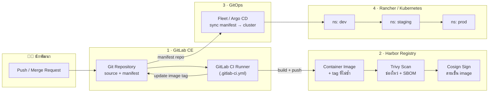
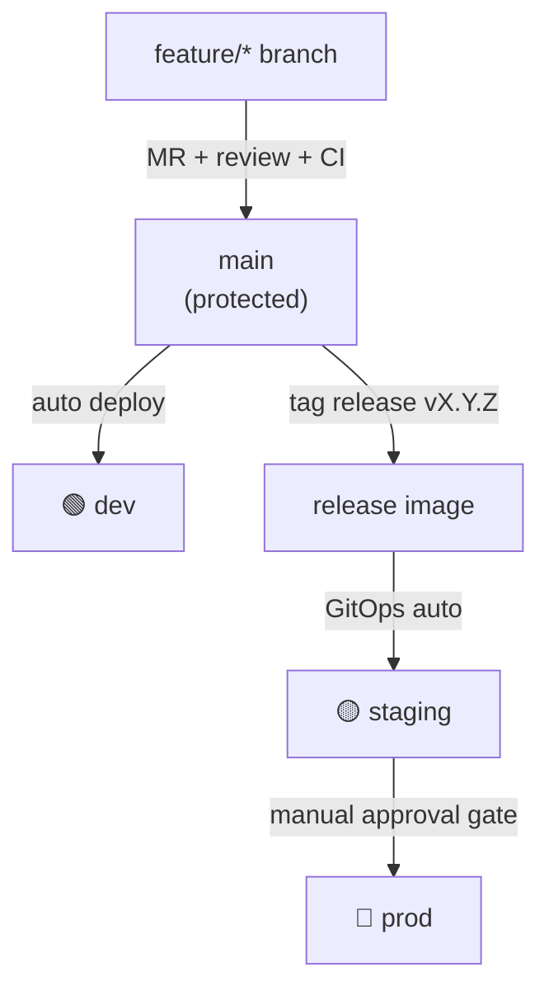
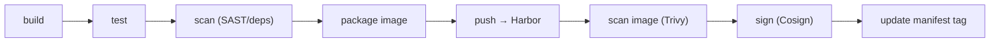
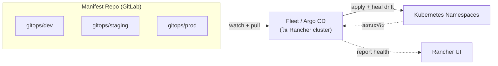

# 🚀 สถาปัตยกรรม CI/CD ภายในองค์กร (Internal CI/CD Pipeline)

> ส่วนหนึ่งของ [[00 - ภาพรวมศูนย์ฯ (MOC)]] — วางท่อส่งมอบซอฟต์แวร์ (build → test → scan → deliver → deploy) สำหรับ**ระบบที่พัฒนาขึ้นเอง** ที่กล่าวถึงใน [[11 - สถาปัตยกรรมบูรณาการข้อมูลและบริการ API]] โดยใช้เครื่องมือที่องค์กรมีอยู่แล้ว: **GitLab CE + Harbor + Rancher (Kubernetes)**

> [!info] เอกสารนี้คืออะไร
> พิมพ์เขียว (blueprint) การทำ **CI/CD แบบ DevSecOps ภายในองค์กร (on-premise)** บนสามเสาหลักที่มีอยู่แล้ว — **GitLab CE** (source + CI runner), **Harbor** (container registry + สแกนช่องโหว่ + ลงลายเซ็น image), **Rancher/K8s** (ปลายทาง deploy) — ครอบคลุมตั้งแต่ กลยุทธ์ branching, ขั้นตอน pipeline, การจัดการ secret, กลยุทธ์ deploy (GitOps), การเลื่อนขั้นข้าม environment, จนถึง**ธรรมาภิบาลและความปลอดภัย**ที่ผูกกับกรอบของศูนย์ฯ

> [!note] ขอบเขตและข้อสมมติ
> - ทุกองค์ประกอบเป็น **self-hosted ภายในองค์กร** (ไม่พึ่ง SaaS ภายนอก) เพื่อให้ข้อมูลและ artifact อยู่ในการควบคุม
> - GitLab CE ใช้ CI/CD ในตัว (`.gitlab-ci.yml`) — ไม่มีฟีเจอร์ enterprise เช่น multi-project approval MR แบบ EE จึงชดเชยด้วยกลไกในเอกสารนี้ (protected branch/env, manual gate, GitOps)
> - workload หลักเป็น **container** deploy ลง Kubernetes ที่บริหารด้วย Rancher
> - ปรับ namespace, ชื่อโปรเจกต์ และผู้อนุมัติให้ตรงบริบทจริงก่อนบังคับใช้

---

## 🧱 ภาพรวมสถาปัตยกรรม (Toolchain Overview)



> [!tip] หลักการออกแบบ (Design Principles)
> **แยก CI ออกจาก CD (CI = build/test/scan, CD = GitOps sync)** · **ทุก artifact ผ่านการสแกนก่อน deploy (shift-left security)** · **Git เป็นแหล่งความจริงเดียวของสถานะระบบ (Git as Single Source of Truth)** · **ไม่ deploy ด้วยมือจาก laptop (no manual kubectl to prod)** · **secret ไม่อยู่ใน repo (no secrets in Git)** · **ทุกการเปลี่ยนแปลง prod ต้องมีร่องรอยและผู้อนุมัติ (auditable + approval gate)**

---

## 🧩 บทบาทของแต่ละเครื่องมือ (Tool Responsibilities)

| เครื่องมือ | บทบาทหลัก | สิ่งที่รับผิดชอบ | ไม่ควรทำ |
|-----------|-----------|-----------------|----------|
| **GitLab CE** | Source of Truth + CI | เก็บ source/manifest · รัน pipeline build/test/scan · เก็บ CI/CD variables · protected branch/env | ไม่เก็บ image binary · ไม่ยิง `kubectl apply` ตรงเข้า prod |
| **GitLab Runner** | ตัวรัน job | build image, unit/integration test, สแกน, push image | ไม่เก็บ secret ถาวรใน runner |
| **Harbor** | Registry + Security Gate | เก็บ image · Trivy สแกนช่องโหว่ · Cosign signing · robot account · quota · retention · replication | ไม่ใช่ที่เก็บ source |
| **Rancher** | บริหาร cluster | จัดการ K8s หลาย cluster · RBAC · project/namespace · ติดตั้ง Fleet/monitoring | ไม่ใช่ CI engine |
| **Fleet / Argo CD** | GitOps CD | sync manifest จาก Git → cluster อัตโนมัติ · ตรวจ drift · rollback | ไม่ build image |

> [!note] ทำไมแยก CI กับ CD
> GitLab ทำ **CI** (สร้างและตรวจ artifact) ให้ดีที่สุด ส่วน **CD** ยกให้ **GitOps (Fleet/Argo)** เป็นตัว "ดึง" (pull) manifest ไป sync เอง — ลดการเปิดสิทธิ์ให้ CI ยิงเข้า cluster ตรง ๆ (ลด attack surface) และได้ **drift detection + rollback ผ่าน git revert** ฟรี

---

## 🌿 กลยุทธ์ Branching และการทริกเกอร์ (Trunk-based + Environment Promotion)



| Branch / Event | ทริกเกอร์ | ทำอะไร | Deploy ไปที่ |
|----------------|-----------|--------|--------------|
| `feature/*` (push) | ทุก push | lint · unit test · build (ไม่ push image) | — |
| Merge Request → `main` | เปิด MR | pipeline เต็ม + สแกน + ต้องผ่านก่อน merge | preview (ถ้ามี) |
| `main` (หลัง merge) | merge สำเร็จ | build + push image tag `main-<sha>` | **dev** อัตโนมัติ |
| Git tag `vX.Y.Z` | สร้าง tag | build image release + sign | **staging** อัตโนมัติ |
| Promote → prod | manual gate (อนุมัติ) | เลื่อน image เดิม (ไม่ build ใหม่) | **prod** |

> [!warning] กฎเหล็กของ branch
> - `main` เป็น **protected branch** — merge ได้เฉพาะผ่าน MR ที่ pipeline เขียว + มีผู้รีวิวอย่างน้อย 1 คน (ผู้เขียนอนุมัติ MR ตัวเองไม่ได้)
> - **prod ใช้ image เดียวกับที่ผ่าน staging** (promote by digest ไม่ build ใหม่) — กัน "build ต่างกันระหว่าง env"
> - tag ที่ deploy จริงต้องเป็น **immutable digest** (`@sha256:...`) ไม่ใช่ `latest`

---

## ⚙️ ขั้นตอน Pipeline (CI Stages)



| Stage | เครื่องมือตัวอย่าง | ผลลัพธ์ / เกณฑ์ผ่าน (Quality Gate) |
|-------|--------------------|-------------------------------------|
| **build** | ภาษาโปรเจกต์ (npm/maven/go...) | compile ผ่าน · cache dependency |
| **test** | unit + integration + coverage | เทสต์ผ่านทั้งหมด · coverage ≥ เกณฑ์ที่ตั้ง |
| **scan (code)** | SAST · dependency scan · secret detection | ไม่มีช่องโหว่ระดับ High/Critical · ไม่มี secret หลุดใน diff |
| **package** | Docker/Kaniko build | image build จาก Dockerfile ที่ pin base image |
| **push** | push เข้า Harbor project | เก็บด้วย tag ที่ไม่ซ้ำ (`<sha>`/`<tag>`) |
| **scan (image)** | **Harbor + Trivy** | **บล็อกถ้าเจอ Critical (นโยบาย "Prevent vulnerable")** |
| **sign** | **Cosign** | image มีลายเซ็นตรวจสอบได้ |
| **update manifest** | เขียน tag กลับ manifest repo | commit ให้ GitOps ไป sync ต่อ |

> [!example] โครง `.gitlab-ci.yml` (ตัวอย่างย่อ)
> ```yaml
> stages: [build, test, scan, package, deploy-dev]
>
> variables:
>   IMAGE: harbor.local/dgsi/${CI_PROJECT_NAME}
>   TAG: ${CI_COMMIT_SHORT_SHA}
>
> unit-test:
>   stage: test
>   script: [ "make test" ]
>   coverage: '/coverage: \d+\.\d+/'
>
> sast:
>   stage: scan
>   script: [ "semgrep ci" ]        # + secret-detection, dependency-scan
>
> build-image:
>   stage: package
>   script:
>     # Kaniko: build โดยไม่ต้องมี docker daemon (ปลอดภัยกว่าใน K8s runner)
>     - /kaniko/executor --context $CI_PROJECT_DIR
>       --dockerfile Dockerfile
>       --destination $IMAGE:$TAG
>   rules:
>     - if: '$CI_COMMIT_BRANCH == "main"'
>
> update-manifest:
>   stage: deploy-dev
>   script:
>     # เขียน image tag ใหม่ลง manifest repo → Fleet/Argo sync เอง
>     - yq -i ".image.tag = \"$TAG\"" gitops/dev/values.yaml
>     - git commit -am "deploy dev $TAG" && git push
>   rules:
>     - if: '$CI_COMMIT_BRANCH == "main"'
> ```
> *หมายเหตุ:* ใช้ **Kaniko** (ไม่ใช่ docker-in-docker) เมื่อ runner อยู่บน K8s — เลี่ยง privileged container · credential Harbor ดึงจาก **robot account** ผ่าน CI variable (masked/protected)

---

## 🐳 การตั้งค่า Harbor (Registry Governance)

| องค์ประกอบ | แนวปฏิบัติ |
|------------|-----------|
| **โครง Project** | แยกตามระบบ/ทีม เช่น `dgsi/`, `library/` (base image ที่อนุมัติแล้ว) · แยก project สำหรับ base image ที่ผ่านการตรวจ |
| **Robot Account** | ออกบัญชีหุ่นยนต์แยกต่อโปรเจกต์: `push` สำหรับ CI, `pull` สำหรับ K8s — ไม่ใช้บัญชีบุคคลใน pipeline |
| **สแกนช่องโหว่** | เปิด **Trivy** scan-on-push + สแกนซ้ำตามรอบ (rescan) เพื่อจับ CVE ที่เพิ่งประกาศ |
| **นโยบายบล็อก** | เปิด **"Prevent vulnerable images from running"** ระดับ Critical (สูงสุด) — pull ไม่ได้ถ้าไม่ผ่าน |
| **Content Trust / Cosign** | บังคับ deploy เฉพาะ image ที่ **มีลายเซ็น** (ตรวจที่ K8s ด้วย policy controller) |
| **Retention & Quota** | ตั้ง retention (เก็บ N tag ล่าสุด/ลบ untagged) + quota ต่อ project กันดิสก์เต็ม |
| **Replication** | ถ้ามีหลาย site/cluster → ตั้ง replication rule เพื่อ mirror image · หรือ proxy-cache ดึง base image จากภายนอกมาสแกนก่อน |
| **Immutability** | ตั้ง tag ของ release ให้ **immutable** กันถูกเขียนทับ (supply-chain integrity) |

> [!warning] Supply Chain Security
> ทุก base image ที่ใช้ต้องมาจาก **Harbor project ที่อนุมัติแล้ว** (`library/`) ไม่ pull ตรงจาก Docker Hub เข้า production — ใช้ Harbor เป็น **proxy cache** เพื่อสแกนและควบคุมเวอร์ชัน ป้องกัน dependency/base-image ปนเปื้อน (ผูกความเสี่ยงใน [[เครื่องมือ/T04 - ทะเบียนความเสี่ยงข้อมูล (Data Risk Register)\|T04 Risk Register]])

---

## 🎯 กลยุทธ์ Deploy (GitOps บน Rancher)



- **Fleet** เป็น GitOps engine ที่ **ติดตั้งมากับ Rancher อยู่แล้ว** — ตัวเลือกแรกที่ควรใช้ (ไม่ต้องเพิ่มระบบใหม่)
- ถ้าต้องการ UI/ฟีเจอร์ deploy ละเอียด (sync wave, rollback ต่อ app) → พิจารณา **Argo CD** เสริม
- แต่ละ environment ผูก **manifest คนละโฟลเดอร์/branch** → เลื่อนขั้นด้วยการ commit เปลี่ยน tag
- **Rollback = `git revert`** แล้วปล่อยให้ GitOps sync กลับ (มีร่องรอยครบ)

| รูปแบบ deploy | เหมาะกับ | หมายเหตุ |
|---------------|----------|----------|
| **Rolling update** | บริการทั่วไป | ค่าเริ่มต้น · ตั้ง readiness/liveness probe ให้ครบ |
| **Blue-Green** | บริการที่ห้าม downtime | สลับ traffic เมื่อ green พร้อม |
| **Canary** | เปลี่ยนใหญ่/เสี่ยงสูง | ปล่อย % ทีละน้อย + ดู metric ก่อนขยาย |

---

## 🌐 Environment และการเลื่อนขั้น (Promotion Flow)

| Environment | Cluster/Namespace | ใครเข้าถึง | ทริกเกอร์ deploy | ข้อมูล |
|-------------|-------------------|-----------|------------------|--------|
| **dev** | `dgsi-dev` | ทีมพัฒนา | อัตโนมัติเมื่อ merge เข้า `main` | ข้อมูลจำลอง (synthetic) |
| **staging** | `dgsi-staging` | ทีม + ผู้ทดสอบ | อัตโนมัติเมื่อ tag release | ข้อมูลใกล้จริง (masked) |
| **prod** | `dgsi-prod` | ผู้ใช้จริง | **manual approval gate** โดยผู้มีสิทธิ์ | ข้อมูลจริง (PDPA) |

> [!warning] Gate ก่อนขึ้น prod
> การขึ้น prod ต้องผ่าน **manual approval** ใน GitLab (protected environment) โดยผู้อนุมัติที่ **แยกจากผู้พัฒนา** (segregation of duties) — และ image ที่ deploy ต้องเป็น**ตัวเดียวกับที่ผ่าน staging** เท่านั้น ห้าม hotfix ตรงเข้า prod โดยไม่ผ่าน pipeline

---

## 🔐 การจัดการ Secret และ Config

| ประเภท | เก็บที่ไหน | หลักปฏิบัติ |
|--------|-----------|-------------|
| **CI/CD credentials** (Harbor robot, token) | GitLab CI/CD Variables | ตั้ง **Masked + Protected** (เห็นเฉพาะ protected branch/env) |
| **Application secret** (DB password, API key) | **External Secret** (Sealed Secrets / Vault / SOPS) | ห้ามเก็บ plaintext ใน manifest repo — เก็บเฉพาะฉบับเข้ารหัส |
| **Kubeconfig / cluster access** | Rancher (ไม่แจก) | CI **ไม่ถือ** kubeconfig prod — GitOps เป็นตัว apply |
| **TLS / cert** | cert-manager ใน cluster | ออก/ต่ออายุอัตโนมัติ |

> [!example] แนวทางแนะนำ (เลือกอย่างใดอย่างหนึ่ง)
> - **Sealed Secrets** — เข้ารหัส secret เป็น `SealedSecret` เก็บใน Git ได้อย่างปลอดภัย ถอดรหัสได้เฉพาะใน cluster (เริ่มง่ายที่สุด)
> - **HashiCorp Vault + External Secrets Operator** — secret อยู่ใน Vault, cluster ดึงมาสร้าง K8s Secret อัตโนมัติ (ยืดหยุ่น เหมาะเมื่อ secret เยอะ/ต้องหมุนบ่อย)

---

## 🛡️ การวางทับธรรมาภิบาลและความปลอดภัย (DevSecOps Governance Overlay)

| ประเด็น | จุดบังคับใช้ใน pipeline | เชื่อมโยง |
|---------|------------------------|-----------|
| **แยกหน้าที่ (SoD)** | ผู้พัฒนา ≠ ผู้อนุมัติ MR ≠ ผู้อนุมัติขึ้น prod | [[02 - โครงสร้างองค์กรและธรรมาภิบาล#📊 ตาราง RACI — กระบวนการสำคัญ\|RACI กลาง]] |
| **สแกนช่องโหว่** | SAST + dependency + image scan บล็อก Critical | นโยบายความปลอดภัยใน [[03 - กลไกการกำกับติดตามและตัวชี้วัด#📜 นโยบายและมาตรฐานหลัก\|เอกสาร 03]] |
| **Secret ไม่หลุด** | secret-detection ใน pipeline + ไม่เก็บ secret ใน repo | [[เครื่องมือ/T08 - แบบบันทึกและตอบสนองเหตุข้อมูลรั่วไหล (Data Incident Report)\|T08 Incident]] |
| **PDPA / ข้อมูลจริง** | prod เท่านั้นที่มีข้อมูลจริง · dev/staging ใช้ข้อมูล masked/synthetic | `#standard/pdpa` · [[11 - สถาปัตยกรรมบูรณาการข้อมูลและบริการ API]] |
| **Audit trail** | ทุก deploy = git commit + pipeline log + approval log | ตรวจย้อนได้ (traceable) |
| **Supply chain** | Cosign signing + base image ที่อนุมัติ + SBOM | [[เครื่องมือ/T04 - ทะเบียนความเสี่ยงข้อมูล (Data Risk Register)\|T04]] |
| **RBAC** | Rancher project/namespace ผูกสิทธิ์ตามทีม (least privilege) | [[02 - โครงสร้างองค์กรและธรรมาภิบาล]] |

---

## 👥 RACI — งาน CI/CD

> R = Responsible, A = Accountable, C = Consulted, I = Informed

| กิจกรรม | CDO/หัวหน้าศูนย์ | Platform/DevOps | นักพัฒนา | Security | Custodian/IT |
|---------|:---:|:---:|:---:|:---:|:---:|
| ออกแบบ/ดูแล pipeline มาตรฐาน | A | R | C | C | I |
| เขียน `.gitlab-ci.yml` ต่อโปรเจกต์ | I | C | R | I | I |
| กำหนดนโยบายสแกน Harbor + gate | A | R | I | R | C |
| อนุมัติ MR เข้า `main` | I | C | R | C | I |
| **อนุมัติ deploy ขึ้น prod** | A | R | C | C | I |
| จัดการ secret/vault | A | R | I | C | R |
| ดูแล cluster/RBAC (Rancher) | A | R | I | C | R |
| ตอบสนองเหตุ deploy ล้ม/rollback | I | R | C | I | C |

> [!warning] แยกหน้าที่ (Segregation of Duties)
> ผู้**อนุมัติขึ้น prod** ต้องไม่ใช่คนเดียวกับ**ผู้เขียนโค้ด**ในการเปลี่ยนแปลงนั้น — สอดคล้องหลักควบคุมภายในใน [[Internal Audit]] และ [[02 - โครงสร้างองค์กรและธรรมาภิบาล#📊 ตาราง RACI — กระบวนการสำคัญ\|RACI กลาง]]

---

## 📈 ตัวชี้วัดและ SLA (DORA Metrics)

| ตัวชี้วัด | นิยาม | เป้าหมายตัวอย่าง | ป้อนเข้า |
|----------|-------|------------------|----------|
| **Deployment Frequency** | ความถี่การ deploy สู่ prod | ≥ รายสัปดาห์ | GitLab / GitOps log |
| **Lead Time for Changes** | เวลาจาก commit → prod | ≤ 1 วันทำการ | GitLab metrics |
| **Change Failure Rate** | % deploy ที่ต้อง rollback/hotfix | ≤ 15% | GitOps + incident |
| **MTTR** | เวลาเฉลี่ยกู้คืนเมื่อ deploy ล้ม | ≤ 1 ชม. | [[เครื่องมือ/T08 - แบบบันทึกและตอบสนองเหตุข้อมูลรั่วไหล (Data Incident Report)\|T08]] |
| **Pipeline Success Rate** | % pipeline ที่ผ่าน | ≥ 95% | GitLab CI |
| **Critical CVE ที่ deploy** | จำนวน image Critical ที่หลุดขึ้น prod | **0** | Harbor scan |
| **% image ที่มีลายเซ็น** | image prod ที่ผ่าน Cosign | 100% | Harbor/policy |

> [!tip] เชื่อมเข้า KPI Dashboard
> ป้อนค่าข้างต้นเข้า [[เครื่องมือ/T09 - แดชบอร์ดติดตาม KPI (KPI Tracker)\|T09 KPI Tracker]] / [[03 - กลไกการกำกับติดตามและตัวชี้วัด#📈 ชุดตัวชี้วัด (KPI Dashboard)\|KPI Dashboard]] เพื่อรายงานสุขภาพการส่งมอบซอฟต์แวร์ต่อ Council

---

## ⚠️ ความเสี่ยงและการรับมือ

| ความเสี่ยง | ผลกระทบ | การรับมือ |
|-----------|---------|-----------|
| Secret หลุดเข้า Git repo | ผู้ไม่หวังดีเข้าถึงระบบ | secret-detection ใน CI · pre-commit hook · เก็บ secret นอก repo · หมุน key |
| Deploy ด้วยมือข้าม pipeline | prod ไม่ตรง Git · drift | ปิดสิทธิ์ `kubectl` ตรงสู่ prod · GitOps heal drift · RBAC เข้ม |
| Image มีช่องโหว่หลุดขึ้น prod | ถูกเจาะ · ข้อมูลรั่ว | Harbor block Critical · rescan ตามรอบ · base image ที่อนุมัติ |
| Runner ถูกยึด (privileged) | รันโค้ดอันตรายในเครือข่าย | ใช้ Kaniko (ไม่ privileged) · แยก runner ต่อ env · ephemeral runner |
| build prod ต่างจาก staging | "ผ่านที่ staging แต่พังที่ prod" | promote by digest ไม่ build ใหม่ · immutable tag |
| GitOps sync ค่าผิดพลาดทั้ง cluster | บริการล่มเป็นวงกว้าง | staging ก่อนเสมอ · sync wave · rollback ด้วย git revert |
| ความรู้กระจุกที่คนเดียว | bus factor สูง | runbook + template pipeline กลาง + อบรม (SVC-08) |
| ไม่มี backup/DR ของ GitLab/Harbor | สูญเสีย source/artifact | backup ตามรอบ + ทดสอบ restore · ผูก [[เครื่องมือ/T04 - ทะเบียนความเสี่ยงข้อมูล (Data Risk Register)\|T04]] |

---

## 📍 สถานะปัจจุบันและช่องว่างที่ต้องปิด (Status & Gaps)

> [!note] วิธีใช้ตารางนี้
> ทำเครื่องหมายตาม**สภาพจริง** — ช่องที่ยัง ⬜ คือ backlog ที่ควรดันต่อเพื่อยกระดับเป็น DevSecOps เต็มรูปแบบ

| ด้าน | สถานะ | สิ่งที่ทำแล้ว / ช่องว่าง |
|------|:----:|--------------------------|
| GitLab CE + Runner | 🟢 | มีแล้ว — ตรวจว่าตั้ง protected branch/env ครบ |
| Harbor registry | 🟢 | มีแล้ว — เปิด Trivy scan-on-push + นโยบายบล็อก Critical |
| Rancher/K8s หลาย env | 🟢 | มีแล้ว — แยก namespace dev/staging/prod + RBAC |
| GitOps (Fleet/Argo) | 🟡 | เปิดใช้ Fleet ที่มากับ Rancher เป็นตัว deploy |
| Template `.gitlab-ci.yml` กลาง | ⬜ | ทำ pipeline มาตรฐานให้ทุกทีม reuse |
| Cosign signing + verify ที่ cluster | ⬜ | ลงลายเซ็น + policy controller ตรวจ |
| External secret (Sealed/Vault) | ⬜ | เลิกเก็บ secret ใน manifest |
| DORA metrics เข้า KPI Dashboard | ⬜ | เชื่อม [[เครื่องมือ/T09 - แดชบอร์ดติดตาม KPI (KPI Tracker)\|T09]] |
| Backup/DR ของ GitLab + Harbor | ⬜ | ตั้ง backup + ทดสอบ restore |

> [!example] ขั้นต่อไปที่แนะนำ (Next Steps)
> 1. ตั้ง **protected branch/env** ใน GitLab + robot account ใน Harbor + เปิดนโยบายบล็อก Critical
> 2. เปิดใช้ **Fleet** (มากับ Rancher) ให้ deploy dev อัตโนมัติจาก manifest repo
> 3. ทำ **template `.gitlab-ci.yml` กลาง** (build/test/scan/package) ให้ทุกโปรเจกต์ include
> 4. เพิ่ม **Cosign signing** + **Sealed Secrets** เพื่อปิดช่อง supply-chain และ secret
> 5. เชื่อม **DORA metrics** เข้า [[03 - กลไกการกำกับติดตามและตัวชี้วัด#📈 ชุดตัวชี้วัด (KPI Dashboard)\|KPI Dashboard]]

---

## ✅ เช็กลิสต์ส่งมอบ (Definition of Done)

- [ ] `main` เป็น protected branch — merge ผ่าน MR + pipeline เขียว + reviewer ≥ 1 เท่านั้น
- [ ] Pipeline มีครบ build → test → scan(code) → package → scan(image) → sign
- [ ] Harbor เปิด Trivy scan-on-push และนโยบาย **block Critical** + robot account แยก push/pull
- [ ] Image ที่ deploy เป็น **immutable digest** + มีลายเซ็น Cosign
- [ ] Deploy ผ่าน **GitOps (Fleet/Argo)** เท่านั้น — ไม่มี `kubectl apply` ตรงเข้า prod
- [ ] แยก env dev/staging/prod ชัดเจน · prod มี **manual approval gate** โดยผู้แยกจากผู้พัฒนา
- [ ] Secret ทั้งหมดอยู่นอก repo (CI variable masked/protected + Sealed Secrets/Vault)
- [ ] prod เท่านั้นที่ใช้ข้อมูลจริง · dev/staging ใช้ข้อมูล masked/synthetic (PDPA)
- [ ] DORA metrics + Critical-CVE = 0 ป้อนเข้า [[เครื่องมือ/T09 - แดชบอร์ดติดตาม KPI (KPI Tracker)\|KPI Dashboard]]
- [ ] มี **backup/DR** ของ GitLab + Harbor และทดสอบ restore แล้ว
- [ ] runbook การ deploy/rollback/แก้ pipeline จัดทำและซ้อมแล้ว
