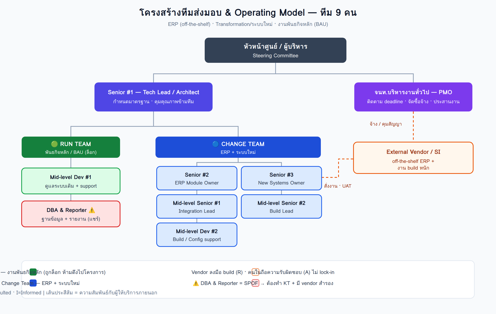
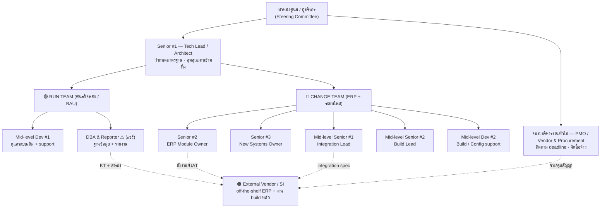

# 🧩 โครงสร้างทีมและ Operating Model (ERP & Transformation)

> ส่วนหนึ่งของ [[00 - ภาพรวมศูนย์ฯ (MOC)]] — การจัดโครงสร้างทีมส่งมอบขนาด 9 คน ให้รองรับโครงการ ERP, การ transform/พัฒนาระบบใหม่ และงานพันธกิจหลัก (BAU) ไปพร้อมกัน

> [!info] บริบทและข้อจำกัด (เป็นฐานของข้อเสนอนี้)
> - **ERP เป็น off-the-shelf** (ซื้อ/implement) → ทีมในเปลี่ยนบทบาทเป็น "ผู้คุม" ไม่ใช่ "ผู้ build ทั้งหมด"
> - **มีงบจ้างภายนอก** → ใช้ vendor/SI รับภาระงาน build หนักได้
> - **งานพันธกิจหลักกำลังถูกละเลย** เพราะทีมถูกดึงไปทำโครงการจนหมดเวลา (ความเสี่ยงเชิงองค์กร)
> - **เร่งด่วน มี deadline ชัด** → ต้องจัดลำดับความสำคัญและตัด scope เป็น phase

---

## 🎯 หลักคิดหลัก (Design Principles)

1. **แยก "Run" ออกจาก "Change"** — กันทีมส่วนหนึ่งไว้ปกป้องพันธกิจหลัก (BAU) เด็ดขาด ห้ามดึงไปโครงการ
2. **ทีมในเป็น "ผู้คุม" ไม่ใช่ "ผู้ลงมือทั้งหมด"** — ใช้ off-the-shelf + vendor รับงาน build แล้วทีมในทำ requirement / integration / UAT / sign-off
3. **มีเจ้าของชัดเจน (Accountability)** — ทุกระบบ/งานมีผู้รับผิดชอบสุดท้าย (A) เพียงคนเดียว
4. **ลด Single Point of Failure** — โดยเฉพาะตำแหน่ง DBA & Reporter ที่มีคนเดียว

---

## 🗂️ ผังโครงสร้างทีม

> [!warning] กลไกปกป้องพันธกิจหลัก
> **Run Team ถูก "ล็อก"** — กันเวลาไว้ ~40–50% และมี governance ห้ามโยกคนไปโครงการ ไม่เช่นนั้นงานพันธกิจหลักจะถูกละเลยซ้ำเหมือนสถานการณ์ปัจจุบัน

---

## 👥 การจัดคนลงบทบาท (9 คน)

| บทบาท | ตำแหน่งในทีม | หน้าที่หลัก | สังกัด |
|-------|--------------|-------------|--------|
| **Tech Lead / Architect** | Senior #1 | กำหนดมาตรฐาน ออกแบบ integration คุมคุณภาพข้ามทีม | ข้ามทีม |
| **ERP Module Owner** | Senior #2 | คุม vendor ERP, requirement, ตัดสินใจ scope | Change |
| **New Systems Owner** | Senior #3 | เจ้าของระบบที่พัฒนาเอง | Change |
| **Integration Lead** | Mid-level Senior #1 | เชื่อม ERP กับระบบเดิม | Change |
| **Build Lead** | Mid-level Senior #2 | นำการพัฒนาส่วนที่ build เอง | Change |
| **Build / Config support** | Mid-level Dev #2 | สนับสนุน build/config | Change |
| **Run Developer** | Mid-level Dev #1 | ดูแลระบบเดิม + support พันธกิจหลัก | Run |
| **DBA & Reporter ⚠** | DBA #1 | ฐานข้อมูล + รายงาน (แชร์ Run/Change) | Run/Change |
| **PMO / Vendor & Procurement** | จนท.บริหารงานทั่วไป | ประสานงาน ติดตาม deadline จัดซื้อจ้าง | Enablement |

---

## 📊 ตาราง RACI — ระบบ/งานหลัก

> R = Responsible (ลงมือทำ) · A = Accountable (รับผิดชอบสุดท้าย) · C = Consulted (ปรึกษา) · I = Informed (รับทราบ)
>
> **ตัวย่อ:** TL=Tech Lead · ERP=ERP Owner · NS=New Systems Owner · INT=Integration Lead · BLD=Build Lead · RUN=Run Dev · CHG=Change Dev · DBA=DBA & Reporter · PMO=PMO/Vendor · VND=Vendor

| ระบบ / งาน | TL | ERP | NS | INT | BLD | RUN | CHG | DBA | PMO | VND |
|-----------|:--:|:---:|:--:|:---:|:---:|:---:|:---:|:---:|:---:|:---:|
| พันธกิจหลัก / BAU support | C | I | I | – | – | **R/A** | – | C | I | – |
| ERP — config & implement | C | **A** | I | C | C | I | C | C | I | **R** |
| ERP — requirement & UAT | C | **R/A** | C | C | – | I | C | C | C | C |
| ระบบใหม่ (build เอง) | C | I | **A** | C | **R** | – | R | C | I | C |
| Integration (ERP ↔ ระบบเดิม) | **A** | C | C | **R** | C | C | C | C | I | C |
| Data / DB administration | C | C | I | C | I | C | I | **R/A** | I | C |
| Reporting / Dashboard | I | C | C | – | – | I | I | **R/A** | C | C |
| Architecture & มาตรฐานเทคนิค | **R/A** | C | C | C | C | I | I | C | I | C |
| Vendor management & สัญญา | C | C | C | I | I | I | I | I | **R/A** | – |
| จัดซื้อจ้าง / งบประมาณ | I | C | C | – | – | – | – | – | **R/A** | – |
| PMO / ติดตาม deadline & ความเสี่ยง | C | C | C | I | I | I | I | I | **R/A** | I |
| KT / ลดความเสี่ยง SPOF | **A** | I | I | C | C | **R** | C | **R** | C | C |
| UAT / Quality sign-off | **A** | R | R | C | C | C | C | C | I | C |

> [!warning] การแยกหน้าที่ (Segregation of Duties)
> - **ERP implement:** Vendor เป็น R (ลงมือ) แต่ ERP Owner เป็น A (รับผิดชอบ) → กัน vendor lock-in
> - **DBA ถือ R/A ทั้ง DB และ Reporting** = SPOF ชัดเจน → ในแถว KT จึงให้ Run Dev ร่วมเป็น R เพื่อรับถ่ายงาน

---

## 🔄 กระบวนการทำงาน (Ways of Working)

- **Capacity allocation แบบล็อก** — กันเวลา Run Team ~40–50% ไว้กับ BAU ห้ามโยกไปโครงการ
- **Agile/Scrum สำหรับ Change** — sprint 2 สัปดาห์ มี demo ทุก sprint
- **Kanban + SLA สำหรับ Run** — งาน support ไหลตามคิว มี SLA กำกับ
- **Vendor-led delivery** — vendor build/implement ส่วนใหญ่ ทีมในทำ requirement → UAT → integration → sign-off
- **Cadence การประชุม:**
  - Daily standup (เฉพาะทีม)
  - Weekly project sync (ข้ามทีม + vendor)
  - Biweekly steering committee (รายงาน deadline / ความเสี่ยง)

---

## ⚠️ ความเสี่ยงหลักและการลดความเสี่ยง

| ความเสี่ยง | ผลกระทบ | วิธีลด |
|-----------|---------|--------|
| DBA / Reporter คนเดียว (SPOF) | งานหยุดเมื่อคนไม่อยู่ | KT + จ้าง vendor สำรอง + ทำเอกสาร/runbook |
| Deadline เร่ง + คนน้อย | ส่งงานไม่ทัน/คุณภาพตก | ตัด scope ทำ phase, ให้ vendor รับงานหนัก, จัดลำดับ MVP |
| BAU ถูกละเลยซ้ำ | พันธกิจหลักเสียหาย | ล็อก Run Team + governance ห้ามดึงคน |
| พึ่ง vendor มากเกินไป | lock-in / ความรู้ไม่อยู่ในองค์กร | ทีมในถือ architecture + บังคับ KT จาก vendor |

---

## 🚀 Quick Wins (3 เดือนแรก)

- **เดือน 1:** ล็อก Run Team ทันที + จ้าง vendor รับงาน build เร่งด่วน → ปลดภาระทีมในทันที
- **เดือน 1–2:** กำหนด MVP scope ของ ERP (เล็กที่สุดที่ go-live ได้) + เริ่ม KT งาน DBA
- **เดือน 2–3:** ตั้ง PMO เบา ๆ + dashboard ติดตาม deadline และ vendor deliverable

> [!note] ข้อสมมติ
> ข้อเสนอนี้อยู่บนสมมติฐาน headcount คงที่ 9 คน และเสริมด้วย vendor ภายนอก โปรดปรับสายการบังคับบัญชาและสัดส่วนเวลาให้สอดคล้องกับบริบทจริงของศูนย์ฯ — ดูโครงสร้างธรรมาภิบาลข้อมูลที่ [[02 - โครงสร้างองค์กรและธรรมาภิบาล]] ประกอบ

---

> [!tip] ไฟล์ที่เกี่ยวข้อง
> - 🖼️ ผังโครงสร้าง (PNG/SVG): `assets/org-chart-delivery-team.png`
> - 🖥️ สไลด์สื่อสารในทีม: [[สไลด์ - โครงสร้างทีมและ Operating Model]]
